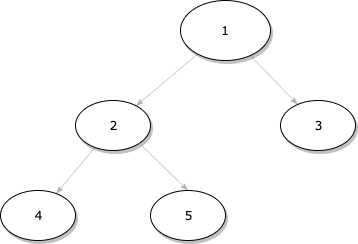
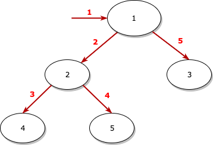
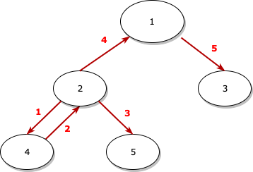
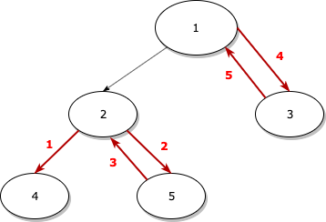
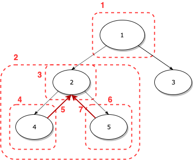

## **이진 트리의 순회 방법**

이진 트리의 순회 방법에는 전위 순회, 중위 순회, 후위 순회가 있습니다.

### 전위 순회(Preorder)
전위 손회는 **루트 노드 &#8594; 왼쪽 노드 &#8594; 오른쪽 노드** 순서로 트리의 노드들을 방문하는 방법입니다. 
전위 순회로 노드들을 방문하면 아래와 같은 순서로 방문하게 됩니다. 

1. 일단 먼저, 트리의 루트 노드인 1을 방문합니다.
2. 1의 왼쪽 노드인 2를 방문합니다.
3. 2의 왼쪽 노드인 4를 방문합니다.
4. 4는 자식이 없으므로 자신의 부모인 2의 오른쪽 노드인 5를 방문합니다.
5. 마지막으로, 1의 오른쪽 노드인 3을 방문합니다.

전위 순회로 순회하면 **1 &#8594; 2 &#8594; 4 &#8594; 5 &#8594; 3** 순서로 노드를 방문하게 됩니다.

### 중위 순회(Inorder)
중위 순회는 **왼쪽 노드 &#8594; 루트 노드 &#8594; 오른쪽 노드** 순서로 트리의 노드들을 방문하는 방법입니다. 
위 그림의 트리를 중위 순회로 노드들을 방문하면 아래와 같은 순서로 방문하게 됩니다.

1. 1의 왼쪽 노드인 2를 방문하려 하지만 2도 왼쪽 노드가 있으므로 2의 왼쪽 노드인 4를 방문합니다.
2. 4의 부모(2-4-5 서브 트리의 루트 노드) 2를 방문합니다.
3. 2의 오른쪽 노드인 5를 방문합니다.
4. 2-4-5 서브 트리의 방문을 마쳤으므로 2-4-5 서브 트리의 부모인 1을 방문합니다.(1의 왼쪽 노드들의 방문을 마쳤다고 표현하는 게 좋을 것 같기도 합니다.)
5. 1의 오른쪽 노드인 3을 방문합니다.

중위 순회로 순회하면 **4 &#8594; 2 &#8594; 5 &#8594; 1 &#8594; 3** 순서로 노드를 방문하게 됩니다.

### 후위 순회(Postorder)
후위 순회는 **왼쪽 노드 &#8594; 오른쪽 노드 &#8594; 루트 노드** 순서로 트리의 노드들을 방문하는 방법입니다. 
전위, 중위 순회들과 다른 점은 루트 노드를 제일 마지막에 방문한다는 점입니다. 
후위 순회로 노드들을 방문하면 아래와 같은 순서로 방문하게 됩니다.

1. 루트 노드인 1의 왼쪽 노드인 2를 방문하려 하지만, 2도 왼쪽 노드가 있으므로 2의 왼쪽 노드인 4를 방문합니다.
2. 2의 오른쪽 노드인 5를 방문합니다.
3. 2의 왼쪽, 오른쪽 노드의 방문을 마쳤으므로 2-4-5 서브 트리의 루트 노드인 2를 빙문합니다.
4. 1의 왼쪽에 대한 방문을 마쳤으므로 1의 오른쪽 노드인 3을 방문합니다.
5. 마지막으로, 전체 트리의 루트 노드인 1을 방문합니다.

후위 순회로 순회하면 **4 &#8594; 5 &#8594; 2 &#8594; 3 &#8594; 1** 순서로 노드를 방문하게 됩니다.

## **이진 트리의 순회 방법 - 구현([전체 코드](https://github.com/SongKJ00/data-structure-study/blob/master/tree/tree_order.cpp))**

### 순회 구현 전 기본 작업

* Node 클래스 구현

~~~cpp
class Node
{
public:
  int data_;    // 노드가 가지고 있는 데이터
  Node* left_;  // 자신의 왼쪽 노드
  Node* right_; // 자신의 오른쪽 노드

public:
  // 생성자 (Constructor)
  Node(int data, Node* left, Node* right) :
  data_(data),
  left_(left),
  right_(right)
  {
  }
};
~~~
 

* Tree 클래스 구현

~~~cpp
class Tree
{
public:
  Node* pRootNode_; // 전체 트리의 루트 노드

public:
  // 전체 트리 루트 노드 setter
  void SetRootNode(Node* rootNode)
  {
    pRootNode_ = rootNode;
  }

  // 전체 트리 루트 노드 getter
  Node* GetRootNode()
  {
    return pRootNode_;
  }
};
~~~
 

* Tree와 Node Instance 생성

~~~cpp
int main(void)
{
  /*       1
   *     <- ->
   *    2     3
   *  <- ->
   * 4     5
   * */

  Tree t;
  Node* n4 = new Node(4, nullptr, nullptr);
  Node* n5 = new Node(5, nullptr, nullptr);
  Node* n2 = new Node(2, n4, n5);
  Node* n3 = new Node(3, nullptr, nullptr);
  Node* n1 = new Node(1, n2, n3);

  t.SetRootNode(n1);
}
~~~

Node는 맨 마지막 레벨부터 첫번째 레벨 순서(역순)으로 생성해줍니다.(왼쪽, 오른쪽 노드를 설정하기 위해)

### 전위 순회
전위 순회는 **루트 노드 &#8594; 왼쪽 노드 &#8594; 오른쪽 노드** 순서로 방문하므로 Tree 클래스 안에 아래와 같은 멤버 함수로 구현합니다.
~~~cpp
/* Tree class member function */
void Preorder(Node* node)
{
  if(node != nullptr)
  {
    std::cout << node->data_ << " ";  // 루트 노드 출력(방문)
    Preorder(node->left_);            // 왼쪽 서브 트리 전위 순회(왼쪽 노드 방문)
    Preorder(node->right_);           // 오른쪽 서브 트리 전위 순회(오른쪽 노들 방문)
  }
}
~~~

main에서는 아래와 같이 호출하여 사용할 수 있습니다.
~~~cpp
/* In main function after generate instance of Tree class */
t.Preorder(t.GetRootNode());
~~~

실제 트리의 순회를 구현할 때 핵심은 **루트 노드는 출력하고 서브 트리는 같은 순회 방법을 다시 적용하는데, 이를 위해 재귀 함수를 이용한다는 점입니다.**

결국, 왼쪽 노드를 방문한다는 것은 자신을 기준으로 왼쪽 서브 트리로 이동하는 것이고, 이 이동한 서브 트리에서 똑같은 순회 방법(여기서는 중위 순회)을 다시 적용하는 것입니다. 

하지만 무기한 왼쪽 서브 트리를 계속 타고 타고 이동할 순 없는 것이고, 결국은 왼쪽 노드가 없는 노드를 방문하게 되면 다시 해당 서브 트리의 루트 노드로 이동하게 됩니다.

전체 트리의 루트 노드인 1에서 왼쪽 노드를 방문하는 것을 그림으로 표현하면 아래와 같습니다.

1. 루트 노드를 먼저 방문합니다.
2. 여기서 왼쪽 노드를 방문하는데 1을 기준으로 왼쪽에 있는 서브 트리(2-4-5)로 이동합니다.
3. 서브 트리의 루트 노드인 2를 방문합니다.
4. 2의 왼쪽 노드를 방문하는데 2를 기준으로 왼쪽에 있는 서브 트리(여기서는 노드 하나도 그냥 트리로 고려하겠습니다.)로 이동한 뒤 루트 노드인 4를 방문합니다.
5. 4는 더 이상 왼쪽이나 오른쪽 서브 트리가 없으므로 다시 자신의 부모인 2로 돌아갑니다.
    - 코드에서는 4의 왼쪽이 null이므로 추가적인 재귀 함수 호출을 멈추고 return합니다.(if문으로 걸러집니다.))
    - return된 이후, 4의 오른쪽도 null이므로 추가적인 재귀 함수 호출을 멈추고 return합니다.
    - 결국, return 2번으로 서브 트리(4)에 대한 순회를 마치고 자신의 부모로 돌아가게 됩니다.
6. 2의 오른쪽 서브 트리로 이동한 뒤 루트 노드인 5를 방문합니다.
7. 5는 더 이상 왼쪽이나 오른쪽 서브 트리가 없으므로 다시 자신의 부모인 2로 돌아갑니다.
    - 5의 왼쪽이 null이므로 추가적인 재귀 함수 호출을 멈추고 return합니다.
    - return된 이후, 5의 오른쪽도 null이므로 추가적인 재귀 함수 호출을 멈추고 return합니다.
    - 결국, return 2번으로 서브 트리(5)에 대한 순회를 마치고 자신의 부모로 돌아가게 됩니다.
8. 2가 루트 노드인 서브 트리의 모든 노드들을 방문했으니 2의 부모인 1로 돌아갑니다.
    - 2의 왼쪽, 오른쪽 서브 트리에서 순회를 마쳤기 때문에 자신의 부모로 돌아갑니다.

결국 순회를 모든 서브 트리에 적용하는 것입니다. 
실제 구현할 때는 이 개념으로 구현하는 것이 더욱 쉬운 것 같습니다.  

### 중위 순회
중위 순회는 **왼쪽 노드 &#8594; 루트 노드 &#8594; 오른쪽 노드** 순서로 방문하므로 Tree 클래스 안에 아래와 같은 멤버 함수로 구현됩니다.
~~~cpp
void Inorder(Node* node)
{
  if(node != nullptr)
  {
    Inorder(node->left_);             // 왼쪽 서브 트리 중위 순회(왼쪽 노드 방문)
    std::cout << node->data_ << " ";  // 루트 노드 출력(방문)
    Inorder(node->right_);            // 오른쪽 서브 트리 중위 순회(오른쪽 노드 방문)
  }
}
~~~

main에서는 아래와 같이 호출하여 사용할 수 있습니다.
~~~cpp
t.Inorder(t.GetRootNode());
~~~

중위 순회 함수 구현에서 재귀 함수 호출 시점만 달라집니다.  

### 후위 순회
후위 순회는 **왼쪽 노드 &#8594; 오른쪽 노드 &#8594; 루트 노드** 순서로 방문하므로 Tree 클래스 안에 아래와 같은 멤버 함수로 구현됩니다.
~~~cpp
void Postorder(Node* node)
{
  if(node != nullptr)
  {
    Postorder(node->left_);           // 왼쪽 서브 트리 후위 순회(왼쪽 노드 방문)
    Postorder(node->right_);          // 오른쪽 서브 트리 후위 순회(오른쪽 노드 방문)
    std::cout << node->data_ << " ";  // 루트 노드 출력(방문)
  }
}
~~~

main에서는 아래와 같이 호출하여 사용할 수 있습니다.
~~~cpp
t.Postorder(t.GetRootNode());
~~~
 
전위이면 루트 노드가 맨 처음, 중위이면 루트 노드가 중간에, 후위이면 루트 노드가 맨 마지막에 방문되고 나머지는 무조건 왼쪽 &rarr; 오른쪽 순서라는 것만 기억하면 외우기 쉬울 것 같습니다.