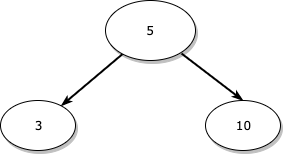
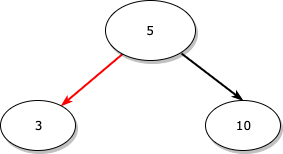
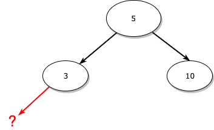
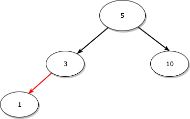

구현에 대한 전체 코드는 [이곳](https://github.com/SongKJ00/data-structure-study/blob/master/tree/binary_search_tree.cpp)에서 확인할 수 있습니다.

## 기본 설계

먼저, 구현할 이진 탐색 트리는 아래와 같은 형태로 되어 있습니다.
<pre>
       5
    &swarr;    &searr;
   3        10
 &swarr;  &searr;    &swarr;   &searr;
1     4  9     11
</pre>

자기 자신보다 왼쪽에는 값이 작은 노드가, 오른쪽에는 값이 큰 노드가 와야 한다는 이진 탐색 트리의 조건으로 인해 3은 5보다 왼쪽에, 11은 10보다 왼쪽에 있습니다.

하지만 여기서, 저는 구현을 조금 더 편리하게 하기 위해 root 노드를 가리킬 head라는 것을 두었습니다.

뒷 부분에 자세히 설명하겠지만, 노드를 삭제할 때는 삭제할 노드와 그 부모 노드를 알고 있어야 하는데 root 노드는 부모가 없으니 root 노드를 삭제할 때는 별도의 처리를 해주어야 합니다.

그런데, 저는 이게 너무 귀찮아서 그냥 root 노드의 부모로 head라는 것이 있다고 가정하고 구현하였습니다.
(이렇게 되면 삭제할 때 root 노드에 대해서만 처리해주는 코드가 추가될 필요가 없습니다.)

그래서 정확히는, 구현할 이진 탐색 트리는 아래와 같은 형태로 되어 있습니다.
<pre>
          HEAD(data : 0)
        &swarr;
       5
    &swarr;    &searr;
   3        10
 &swarr;  &searr;    &swarr;   &searr;
1     4  9     11
</pre>

0이란 값으로 초기화한 head 노드를 만들고 왼쪽을 루트 노드를 가리키도록 했습니다.
(head는 어차피 삭제나 순회의 대상이 아니므로, 꼭 루트 노드보다 왼쪽에 와야 한다던가 꼭 루트 노드보다 오른쪽에 와야 할 이유는 없습니다. - 그냥 왼쪽이든 오른쪽이든 아무데나 두세요.)
  

## Node 클래스와 Tree 클래스 설계
### Node 클래스
Node 클래스는 트리의 구성 요소인 노드를 나타내는 클래스입니다.
Node 클래스는 아래와 같이 구현하였습니다.

~~~cpp
class Node
{
public:
  // 왼쪽, 오른쪽 자식 노드에 접근할 때 사용하는 map의 key(left, right)를 위한 enum class
  enum class CHILD_TYPE{
    LEFT,
    RIGHT
  };

  int data_;                                  // 노드가 담고 있는 실제 데이터
  std::map<Node::CHILD_TYPE, Node*> children; // 왼쪽, 오른쪽 자식 노드를 가리킬 포인터 - 맵 이용
public:
  // Node 클래스 생성자
  // data_를 초기화하고, 왼쪽 오른쪽 자식 노드에 대한 포인터를 null로 초기화한다.
  Node(int data) :
    data_(data)
  {
    children[Node::CHILD_TYPE::LEFT] = nullptr;
    children[Node::CHILD_TYPE::RIGHT] = nullptr;
  }
};
~~~

제가 여기서 왼쪽, 오른쪽 자식 노드를 가리킬 포인터를 위해 그냥 단순히 포인터 변수(ex) __Node* left, Node* right__)를 사용하지 않고, map을 이용하고 key로 enum class를 사용한 이유는 노드의 왼쪽만 순회하거나, 오른쪽만 순회할 때 똑같은 로직의 코드를 두 번에 걸쳐서 적는 것을 피하기 위해서입니다. 

이는 추후 삭제 부분에서 자세히 설명하겠습니다.

### Tree 클래스
Tree 클래스의 멤버 함수들에 대한 자세한 코드 설명은 뒷 부분에서 삽입, 삭제를 다룰 때 자세히 설명하겠습니다.

사실 지금은 바로 코드를 하나하나씩 설명하는 게 아니니 굳이 이 부분은 자세히 읽을 필요가 없고 그냥 이런 멤버 함수들이 있겠구나 짚고 넘어가시면 될 것 같습니다.

~~~cpp
class Tree
{
public:
  Node* head_;    // 루트 노드를 자식 노드로 가리킬 head 노드

public:
  // 생성자
  // head 노드의 데이터를 default로 0으로 초기화하고, 루트 노드를 할당하여 head의 왼쪽에 연결해줍니다.
  Tree(int data) :
    head_(new Node(0))
  {
    head_->children[Node::CHILD_TYPE::LEFT] = new Node(data);
  }

  Node* GetRootNode();            // 현재 트리의 root node getter
  void SetRootNode(Node* node);   // 현재 트리의 root node setter
  void Inorder(Node* node);       // 트리를 중위 순회합니다.(트리 노드들 데이터 출력)
  void InsertNode(int data);      // DoInsertNode의 wrapper 함수.
  void DeleteNode(int data);      // DoDeleteNode의 wrapper 함수.

private:
  void DoInsertNode(int data);    // 노드를 새로 생성하여 삽입.
  void DoDeleteNode(int data);    // 트리에 있는 기존 노드를 찾아 삭제.
  Node* GetSwapNode(Node* root, Node::CHILD_TYPE direction);  // 삭제 시 삭제할 노드의 부모의 왼쪽 or 오른쪽에 링크를 걸어줄 노드를 return.(삭제할 노드의 위치를 대체할 노드를 찾아 return)
  std::pair<Node*, Node*> SearchNode(int data); // 삭제할 노드와 그 부모 노드를 return
~~~

## 삽입의 개념과 구현
### 개념
삽입의 개념과 구현은 어렵지 않고 매우 단순합니다.

자신의 왼쪽에는 작은 값을 가진 노드만 오고, 오른쪽에는 큰 값을 가진 노드만 온다는 이진 탐색 트리의 규칙에 어긋나지 않으면서 링크만 제대로 걸어주면 됩니다.

위와 같은 이진 탐색 트리가 있을 때, 새로운 노드 1을 삽입하는 과정은 아래와 같습니다.

1. 일단 루트 노드로 이동합니다.

2. 새로 삽입할 노드가 루트 노드의 값보다 작으면 루트 노드의 왼쪽, 크면 루트 노드의 오른쪽으로 이동합니다.
  
  
  새로 삽입할 노드인 1은 루트 노드인 5보다 작으므로 왼쪽으로 이동합니다.

  3으로 이동한 상태입니다.
  
3. 현재 이동한 노드보다 작으면 **2번 과정**과 같이 왼쪽으로, 크면 오른쪽으로 이동합니다.

   

   1은 3보다 작으니 3의 왼쪽으로 이동합니다.

   그러나, 여기서 3은 더 이상 왼쪽 자식이 없는 노드이므로 바로 여기에 1을 할당해줍니다.

   새로운 노드 1을 삽입한 트리의 형태는 아래 그림과 같습니다.

   

결국, 삽입의 과정은 아래와 같이 정리됩니다.

~~~
1. 새로 삽입할 노드가 현재 노드보다 작으면 현재 노드의 왼쪽 자식으로, 크면 오른쪽 자식으로 이동한다.

2. 이동할 위치에 노드가 할당되어 있지 않다면 그곳에 새로 삽입할 노드를 할당한다.
~~~

2번의 경우,  **왼쪽으로 이동해야 되는데 현재 노드가 왼쪽 자식이 없으면 현재 노드의 왼쪽 자식에 할당하고, 오른쪽으로 이동해야 되는데 현재 노드가 오른쪽 자식이 없으면 현재 노드의 오른쪽 자식에 할당합니다.**라고 부연 설명을 할 수 있을 것 같습니다.

## 구현

### 새로운 노드가 할당 될 위치 찾기

~~~c++
Node* currParentNode = head_;   // 현재 노드의 부모를 저장할 포인터
Node* currNode = GetRootNode(); // 현재 노드를 저장할 포인터

// 현재 노드가 null일 때까지(더 이상 트리의 밑으로 내려갈 수 없을 때까지)
while(currNode)
{
  // data가 중복되는 경우(트리에 이미 있는 경우)
  if(data == currNode->data_)
  {
    throw std::runtime_error("data is already existed. data : " + std::to_string(data));
  }

  currParentNode = currNode;

  // 현재 노드보다 값이 작은 경우 -> 현재 노드의 왼쪽으로 이동
  if(data < currNode->data_)
  {
    currNode = currNode->children[Node::CHILD_TYPE::LEFT];
  }
  // 현재 노드보다 값이 큰 경우 -> 현재 노드의 오른쪽으로 이동
  else
  {
    currNode = currNode->children[Node::CHILD_TYPE::RIGHT];
  }
}
~~~

주석에 열심히 설명을 달아놓았지만 조금 더 설명을 보태겠습니다.

먼저, currParentNode는 현재 노드의 부모 노드, currNode는 현재 노드이며 제일 처음 각각 head와 root로 할당해줍니다.
(제가 위에서 설명했지만 구현상 편의를 위해 root의 부모인 head를 두었습니다.)

그 다음 새로 삽입할 값이 현재 노드보다 작으면 현재 노드를 현재 노드의 왼쪽으로 바꾸고, 크면 현재 노드의 오른쪽으로 바꿉니다.
이를 구현하기 위해 currNode를 currNode의 left나 right로 할당해줍니다.

또한, currNode를 바꾸기 전에 미리 currParentNode를 currNode로 할당해두어서 currNode의 왼쪽이나 오른쪽으로 변경된 currNode의 부모를 가리키게 합니다.

### 찾은 위치에 새로운 노드 할당하기

~~~c++
Node* newNode = new Node(data);
// 현재 노드의 부모보다 값이 작은 경우 -> 부모의 왼쪽에 할당
if(data < currParentNode->data_)
{
  currParentNode->children[Node::CHILD_TYPE::LEFT] = newNode;
}
// 현재 노드의 부모보다 값이 큰 경우 -> 부모의 오른쪽에 할당
else
{
  currParentNode->children[Node::CHILD_TYPE::RIGHT] = newNode;
}
~~~

일단 먼저, 새로운 노드인 newNode를 data로 동적 할당합니다.

그 다음, data를 currNode**(currNode는 현재 null입니다.)**의 부모인 currParentNode의 data와 크기 비교하여 부모의 왼쪽에 할당할지 오른쪽에 할당할지 결정한 뒤 newNode로 링크를 걸어줍니다.

### 전체 코드

~~~cpp
void DoInsertNode(int data)
{
  Node* currParentNode = head_;   // 현재 노드의 부모를 저장할 포인터
  Node* currNode = GetRootNode(); // 현재 노드를 저장할 포인터
  
  // 현재 노드가 null일 때까지(더 이상 트리의 밑으로 내려갈 수 없을 때까지)
  while(currNode)
  {
    // data가 중복되는 경우(트리에 이미 있는 경우)
    if(data == currNode->data_)
    {
      throw std::runtime_error("data is already existed. data : " + std::to_string(data));
    }
    
    currParentNode = currNode;

    // 현재 노드보다 값이 작은 경우 -> 현재 노드의 왼쪽으로 이동
    if(data < currNode->data_)
    {
      currNode = currNode->children[Node::CHILD_TYPE::LEFT];
    }
    // 현재 노드보다 값이 큰 경우 -> 현재 노드의 오른쪽으로 이동
    else
    {
      currNode = currNode->children[Node::CHILD_TYPE::RIGHT];
    }
  }

  Node* newNode = new Node(data);
  // 현재 노드의 부모보다 값이 작은 경우 -> 부모의 왼쪽에 할당
  if(data < currParentNode->data_)
  {
    currParentNode->children[Node::CHILD_TYPE::LEFT] = newNode;
  }
  // 현재 노드의 부모보다 값이 큰 경우 -> 부모의 오른쪽에 할당
  else
  {
    currParentNode->children[Node::CHILD_TYPE::RIGHT] = newNode;
  }
}
~~~

## 삽입 후 중위 순회로 결과 확인

main 함수에서 Tree를 생성 및 노드를 삽입한 뒤 중위 순회하여 이진 탐색 트리의 규칙을 지키면서 제대로 삽입되었는지 확인해보았습니다.

### 삽입 - main 함수

~~~cpp
int main(void)
{
  /*
   *         HEAD
   *        /
   *       5 <- ROOT
   *     /   \
   *    3    10
   *   / \   / \
   *  1   4 9   11
   */
  /* Insert */
  Tree t(5);
  t.InsertNode(3);
  t.InsertNode(1);
  t.InsertNode(10);
  t.InsertNode(9);
  t.InsertNode(4);
  t.InsertNode(11);

  /* Print Inorder result */
  std::cout << "Before delete" << std::endl;
  t.Inorder(t.GetRootNode());
  std::cout << std::endl;
}
~~~

### 중위 순회 함수 구현 및 결과

중위 순회 함수는 아래와 같이 구현되어 있습니다.(중위 순회에 대한 설명은 [이 페이지](https://songkj00.github.io/tree-order/)에서 확인할 수 있습니다.)

~~~c++
void Inorder(Node* node)
{
  if(node != nullptr)
  {
    Inorder(node->children[Node::CHILD_TYPE::LEFT]);
    std::cout << node->data_ << " ";
    Inorder(node->children[Node::CHILD_TYPE::RIGHT]);
  }
}
~~~

중위 순회 결과는 아래와 같습니다.

~~~bash
Before delete
1 3 4 5 9 10 11 
~~~

**왼쪽 노드 &rarr; 루트 노드 &rarr; 오른쪽 노드** 순서로 방문하는 중위 순회의 개념에 맞게 결과가 제대로 출력된 것을 확인할 수 있습니다.