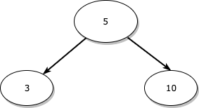
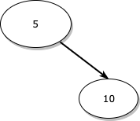
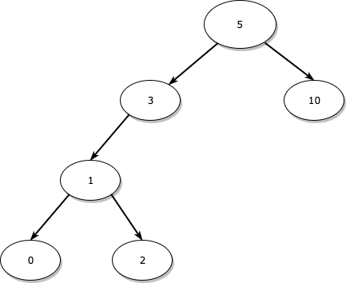
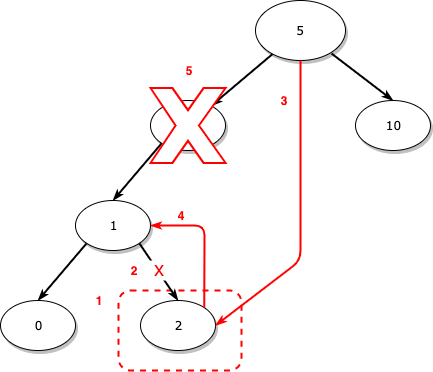
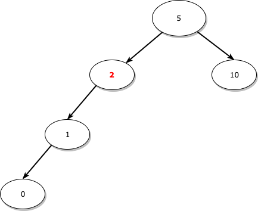
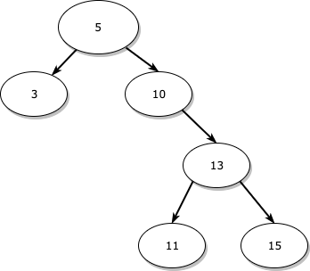
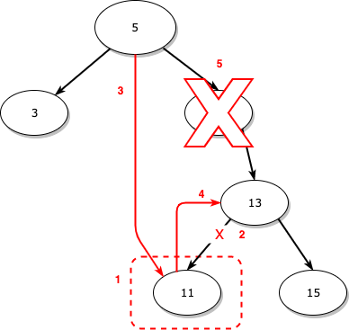
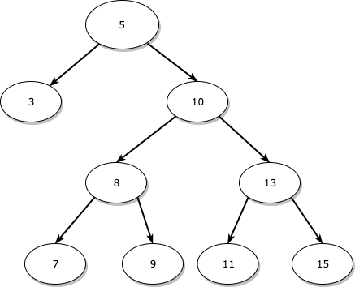
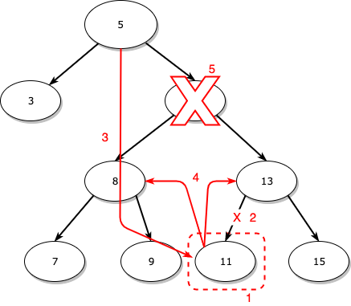

[이진 탐색 트리(Binary Search Tree) 구현 - 기본 개념 및 삽입](https://songkj00.github.io/binary-search-tree-impl-1/) 글을 먼저 읽고 오시면 이 글을 이해하는데 더욱 좋을 것 같습니다.

구현에 대한 전체 코드는 [이곳](https://github.com/SongKJ00/data-structure-study/blob/master/tree/binary_search_tree.cpp)에서 확인할 수 있습니다.

## 삭제의 개념

삭제는 삽입과 다르게 되게 많은 케이스를 생각해야 합니다.

제가 정리한 삭제에 대한 케이스는 아래와 같습니다.

* 자식이 없는 노드(잎 노드)에 대한 삭제
* 왼쪽 자식만 있는 노드에 대한 삭제
* 오른쪽 자식만 있는 노드에 대한 삭제
* 왼쪽 자식, 오른쪽 자식 둘 다 있는 노드에 대한 삭제

순서대로 정리해보겠습니다.

1. **자식이 없는 노드(잎 노드)에 대한 삭제**

   

   이와 같은 트리에서 자식이 없는 노드인 3을 지운다고 가정해보겠습니다.

   3을 delete하고 3의 부모인 5의 왼쪽 자식에 대한 포인터를 null로 만들어주면 됩니다.

   3을 삭제하고 난 뒤의 트리의 형태는 아래와 같이 됩니다.

   

2. **왼쪽 자식만 있는 노드에 대한 삭제**

   

   이와 같은 트리에서 왼쪽 자식만 있는(정확히는 왼쪽 서브 트리만 있는) 노드인 3을 지운다고 가정해보겠습니다.

   이렇게 자식이 있는 노드를 삭제하는 경우는 조금 복잡한데, 일단 결과만 알려드리자면 **서브 트리의 가장 오른쪽 노드를 삭제하려는 노드의 위치로 옮겨주어야 합니다.**

   과정은 아래와 같습니다.

   

   1. 서브 트리의 가장 오른쪽 노드인 2를 찾습니다.
   2. 2의 부모와 연결을 끊습니다.
      이 경우에는 부모인 1의 오른쪽 자식에 대한 포인터를 null로 만들어줍니다.
   3. 삭제하려는 노드인 3이 부모인 5의 왼쪽에 있으므로 5의 왼쪽에 2를 연결시켜 줍니다.
      만약, 삭제하려는 노드가 부모의 오른쪽에 있었다면, 대체하는 노드를 부모의 오른쪽에 연결시켜 주어야 합니다.
   4. 2의 왼쪽에 원래 3의 왼쪽 자식인 1을 연결시켜 줍니다.
   5. 마지막으로, 3을 삭제합니다.

   

   이 과정을 거치고 난 뒤의 트리 형태는 아래와 같습니다.

   

   

   3의 위치를 정확히 새로운 노드인 2가 대체합니다.

   삭제하려는 노드의 서브 트리에서 가장 오른쪽 노드를 삭제하려는 노드의 위치에 두어야 **자신의 왼쪽에는 자신보다 작은 값을 가진 노드가, 오른쪽에는 자신보다 큰 값을 가진 노드만 온다**는 이진 탐색 트리의 규칙에 위배되지 않습니다.

3. **오른쪽 자식만 있는 노드에 대한 삭제**

   오른쪽 자식만 있는 노드에 대한 삭제는 왼쪽 자식만 있는 노드에 대한 삭제와 거의 똑같지만 다른점 하나는 **삭제하려는 노드를 대체하는 노드가 서브 트리의 가장 오른쪽 노드가 아닌 가장 왼쪽 노드라는 점**입니다.

   아래와 같은 트리가 있다고 가정해보겠습니다.

   

   여기서 10을 삭제할 때 만약 서브 트리의 가장 오른쪽 노드인 15를 10의 위치로 대체한다면 어떻게 될까요?

   그렇게 된다면, 13이 15보다 오른쪽에 있게 되는데, 이는 **자신의 오른쪽에는 자신보다 큰 값을 가진 노드만 와야 한다는 이진 탐색 트리의 규칙에 위배됩니다.**

   그래서 오른쪽 자식만 있는 노드에 대한 삭제를 할 때는 서브 트리의 가장 왼쪽 노드를 사용해야 합니다.

   **왜냐하면, 서브 트리의 가장 왼쪽 노드는 해당 서브 트리에서 가장 작은 값이라는 것이 보장되기 때문에 가장 왼쪽 노드로 대체했을 때 오른쪽에는 무조건 보다 큰 값을 가진 노드들만 오게 됩니다.**

   그러면 당연히 이 경우에는 15 대신 11을 사용해야 합니다.

   과정은 왼쪽 자식만 있는 노드에 대한 삭제와 비슷하지만 그래도 한 번 정리하면 아래와 같습니다.

   

   1. 서브 트리의 가장 왼쪽 노드인 11을 찾습니다.
   2. 11의 부모와 연결을 끊습니다.
      이 경우에는 부모인 13의 왼쪽 자식에 대한 포인터를 null로 만들어줍니다.
   3. 삭제하려는 노드인 10이 부모인 5의 오른쪽에 있으므로 5의 오른쪽에 11을 연결시켜 줍니다.
   4. 11의 오른쪽에 원래 15의 오른쪽 자식인 13을 연결시켜 줍니다.
   5. 마지막으로, 10을 삭제합니다.

   

4. **왼쪽 자식, 오른쪽 자식 둘 다 있는 노드에 대한 삭제**

   양 쪽에 모두 자식이 있는 노드에 대한 삭제를 할 때는 **대체하는 노드를 왼쪽 서브 트리의 가장 오른쪽 노드로 정하거나, 오른쪽 서브 트리의 가장 왼쪽 노드로 정하면 됩니다.**

   둘 중 어느 경우를 택하든지 상관 없고 구현하는 사람의 마음입니다.

   저는 오른쪽 서브 트리의 가장 왼쪽 노드를 선택했습니다.

   아래와 같은 형태의 트리가 있다고 가정해보겠습니다.

   

   여기서 10을 삭제하는 과정은 아래와 같습니다.

   

   1. 오른쪽 서브 트리의 가장 왼쪽 노드인 11을 찾습니다.
   2. 11의 부모와 연결을 끊습니다.
      이 경우에는 부모인 13의 왼쪽 자식에 대한 포인터를 null로 만들어줍니다.
   3. 삭제하려는 노드인 10이 부모인 5의 오른쪽에 있으므로 5의 오른쪽에 11을 연결시켜 줍니다.
   4. **11의 오른쪽에 원래 15의 오른쪽 자식인 13을, 11의 왼쪽에 원래 15의 왼쪽 자식인 8을 연결시켜 줍니다.**
   5. 마지막으로, 10을 삭제합니다.

   양쪽에 자식(서브 트리)이 있는 노드를 삭제할 때 가장 중요한 점은 **4번 과정**입니다.

   링크를 오른쪽이나 왼쪽만 걸어주는 것이 아닌 삭제하려는 노드의 왼쪽, 오른쪽 자식에 대한 링크를 그대로 대체하는 노드에 걸어주어야 합니다.

## 삭제 구현

### 삭제하려는 노드 찾기

~~~c++
/* Find node that data is equal with argument */
/* return type : first - parent pointer, second - current pointer */
std::pair<Node*, Node*> SearchNode(int data)
{
  Node* currParentNode = head_;		// 삭제하려는 노드의 부모 노드 포인터
  Node* currNode = GetRootNode();	// 삭제하려는 노드 포인터
  
  while(currNode)
  {
    // data is equal with argument
    // return current node pointer
    if(currNode->data_ == data)
    {
      return std::make_pair(currParentNode, currNode);
    }

    currParentNode = currNode;

    if(data < currNode->data_)
    {
      currNode = currNode->children[Node::CHILD_TYPE::LEFT];
    }
    else
    {
      currNode = currNode->children[Node::CHILD_TYPE::RIGHT];
    }
  }

  throw std::runtime_error("Cannot find " + std::to_string(data));
}
~~~

SearchNode 함수는 삭제하려는 노드의 데이터인 data를 parameter로 받아 삭제하려는 노드의 포인터, 삭제하려는 노드의 부모의 포인터를 std::pair로 return합니다.

pair의 first는 삭제하려는 노드의 부모의 포인터, second는 삭제하려는 노드의 포인터입니다.

트리의 루트 노드부터 방문하여 데이터가 현재 노드보다 작으면 현재 노드의 왼쪽으로, 크면 현재 노드의 오른쪽으로 이동하면서 삭제하려는 노드를 찾으면 그대로 pair를 만들어 return합니다.

만약 현재 노드가 null일 때까지 못 찾았다면, 더 이상 해당 데이터가 트리에 존재하지 않는 것이므로 exception을 throw합니다.

### 대체하는 노드 찾기(삭제하려는 노드의 위치에 놓을 노드 찾기)

~~~cpp
Node* GetSwapNode(Node* root, Node::CHILD_TYPE direction)
{
  Node* parentNode = root;
	
  if(parentNode->children[direction] == nullptr)
  {
    return parentNode;
  }
  
  while(parentNode->children[direction])
  {
    Node* swapNode = parentNode->children[direction];
    if(swapNode->children[direction] == nullptr)
    {
      parentNode->children[direction] = nullptr;
      return swapNode;
    }
    parentNode = parentNode->children[direction];
  }
  
  throw std::runtime_error("Cannot find swap node!");
}
~~~

대체하는 노드를 찾아 해당 노드의 포인터를 return하는 GetSwapNode는 서브 트리의 루트 노드, 그리고 이동할 방향을 parameter로 받습니다.

direction은 아래와 같이 설정해야 합니다.

* 삭제하려는 노드가 왼쪽 자식만 있는 경우
  * 서브 트리의 가장 오른쪽 노드를 찾아야 하므로 Node::CHILD_TYPE::RIGHT를 받아야 합니다.
* 삭제하려는 노드가 오른쪽 자식만 있거나, 양쪽에 모두 자식이 있는 경우
  * 서브 트리의 가장 왼쪽 노드를 찾아야 하므로 Node::CHILD_TYPE::LEFT를 받아야 합니다.

만약, 루트 노드가 해당 방향에 자식 노드가 없다면 바로 루트 노드를 return합니다.
이 이유는 서브 트리에서 가장 왼쪽 노드를 찾으려 하는데 서브 트리의 루트 노드가 왼쪽 자식이 없다면 루트 노드가 바로 가장 왼쪽 노드(서브 트리에서 가장 값이 작은 노드)이기 때문입니다.

루트 노드가 해당 방향에 자식 노드가 있다면 해당 방향에 자식 노드가 없는 노드를 찾을 때까지 해당 방향으로 이동합니다.

해당 방향에 자식 노드가 없는 노드가 있다면 그 노드가 대체하는 노드입니다.

따라서, 해당 노드의 부모와의 링크를 끊습니다.(부모의 해당 방향 포인터를 null로 만들어줍니다.)

그 다음, 해당 노드의 포인터를 return합니다.

### 삭제

~~~c++
void DoDeleteNode(int data)
{
  std::pair<Node*, Node*> p = SearchNode(data); // 삭제할 노드 검색
  Node* parent = p.first;
  Node* target = p.second;
  bool isTargetLeftOfParent = parent->children[Node::CHILD_TYPE::LEFT] == target ? true : false;

  // 잎 노드인 경우
  if((target->children[Node::CHILD_TYPE::LEFT] == nullptr) && (target->children[Node::CHILD_TYPE::RIGHT] == nullptr))
  {
    if(isTargetLeftOfParent)
    {
      parent->children[Node::CHILD_TYPE::LEFT] = nullptr;
    }
    else
    {
      parent->children[Node::CHILD_TYPE::RIGHT] = nullptr;
    }
    delete target;
  }
  // 왼쪽 서브 트리만 있는 경우
  else if((target->children[Node::CHILD_TYPE::LEFT] != nullptr) && (target->children[Node::CHILD_TYPE::RIGHT] == nullptr))
  {
    Node* swapNode = GetSwapNode(target->children[Node::CHILD_TYPE::LEFT], Node::CHILD_TYPE::LEFT);
    if(isTargetLeftOfParent)
    {
      parent->children[Node::CHILD_TYPE::LEFT] = swapNode;
    }
    else
    {
      parent->children[Node::CHILD_TYPE::RIGHT] = swapNode;
    }

    if(target->children[Node::CHILD_TYPE::LEFT] != swapNode)
    {
      swapNode->children[Node::CHILD_TYPE::LEFT] = target->children[Node::CHILD_TYPE::LEFT];
    }
    delete target;
  }
  // 오른쪽 서브 트리만 있는 경우
  else if((target->children[Node::CHILD_TYPE::LEFT] == nullptr) && (target->children[Node::CHILD_TYPE::RIGHT] != nullptr))
  {
    Node* swapNode = GetSwapNode(target->children[Node::CHILD_TYPE::RIGHT],
                                 Node::CHILD_TYPE::LEFT);
    if(isTargetLeftOfParent)
    {
      parent->children[Node::CHILD_TYPE::LEFT] = swapNode;
    }
    else
    {
      parent->children[Node::CHILD_TYPE::RIGHT] = swapNode;
    }

    if(target->children[Node::CHILD_TYPE::RIGHT] != swapNode)
    {
      swapNode->children[Node::CHILD_TYPE::RIGHT] = target->children[Node::CHILD_TYPE::RIGHT];
    }
    delete target;
  }
  // 양 쪽에 서브 트리가 있는 경우
  else
  {
    Node* swapNode = GetSwapNode(target->children[Node::CHILD_TYPE::RIGHT], Node::CHILD_TYPE::LEFT);
    if(isTargetLeftOfParent)
    {
      parent->children[Node::CHILD_TYPE::LEFT] = swapNode;
    }
    else
    {
      parent->children[Node::CHILD_TYPE::RIGHT] = swapNode;
    }

    if(swapNode != target->children[Node::CHILD_TYPE::LEFT])
    {
      swapNode->children[Node::CHILD_TYPE::LEFT] = target->children[Node::CHILD_TYPE::LEFT];
    }
    if(swapNode != target->children[Node::CHILD_TYPE::RIGHT])
    {
      swapNode->children[Node::CHILD_TYPE::RIGHT] = target->children[Node::CHILD_TYPE::RIGHT];
    }
    delete target;
  }
}
~~~

삭제의 과정은 아래와 같이 이뤄집니다.

1. 먼저, 삭제하려는 노드와 삭제하려는 노드의 부모에 대한 포인터를 SearchNode 함수를 통해 가져옵니다.
2. 삭제하려는 노드가 부모의 왼쪽에 있는지, 오른쪽에 있는지에 대한 정보를 isTargetLeftOfParent bool 변수에 저장합니다.
3. 삭제하려는 노드가 자식이 있는지, 있다면 어느 쪽에 있는지 알아낸 뒤 경우에 따른 삭제 처리를 진행합니다.
   * 자식이 없는 경우(왼쪽, 오른쪽 자식에 대한 포인터가 모두 null인 경우)
     * 삭제하려는 노드와 부모의 연결을 끊습니다.(부모가 삭제하려는 노드와 연결된 방향에 대한 자식 포인터를 null로 만듭니다.)
     * 노드를 삭제합니다.
   * 왼쪽에만 자식이 있는 경우(오른쪽 자식에 대한 포인터만 null인 경우)
     * GetSwapNode 함수를 통해 대체하는 노드인 swapNode를 알아냅니다.(왼쪽에만 자식이 있으므로 direction 인자를 가장 오른쪽 노드를 찾기 위해 RIGHT로 줍니다.)
     * 부모가 삭제하려는 노드와 연결되었던 방향에 swapNode를 연결합니다.(삭제하려는 노드가 부모의 왼쪽에 있었다면 swapNode를 부모의 왼쪽에, 오른쪽에 있었다면 부모의 오른쪽에 그대로 연결합니다.)
     * **그 다음, 대체하는 노드와 삭제하려는 노드가 부모-자식 관계가 아닌 경우에만 삭제하려는 노드의 왼쪽 자식 포인터를 그대로 대체하는 노드의 왼쪽 자식 포인터에 할당합니다.**
       * 만약 대체하는 노드와 삭제하려는 노드가 부모-자식 관계인데도 해당 내용을 적용해버린다면, 자식의 왼쪽 자식 포인터에 부모의 왼쪽 자식 포인터를 할당하는 것인데, 부모의 왼쪽 자식 포인터는 결국 대체하는 노드 자기 자신이므로 대체하는 노드의 왼쪽 자식 포인터가 자기 자신을 가리키게 되어버리는 링(Ring) 형태가 되어버리게 됩니다.
       * 따라서 이 경우는 걸러주어야 합니다.
     * 노드를 삭제합니다.
   * 오른쪽에만 자식이 있는 경우(왼쪽 자식에 대한 포인터만 null인 경우)
     * GetSwapNode 함수를 통해 대체하는 노드인 swapNode를 알아냅니다.(오른쪽에만 자식이 있으므로 direction 인자를 가장 왼쪽 노드를 찾기 위해 LEFT로 줍니다.)
     * 부모가 삭제하려는 노드와 연결되었던 방향에 swapNode를 연결합니다.(삭제하려는 노드가 부모의 왼쪽에 있었다면 swapNode를 부모의 왼쪽에, 오른쪽에 있었다면 부모의 오른쪽에 그대로 연결합니다.)
     * 왼쪽에만 자식이 있는 경우와 마찬가지로, **대체하는 노드와 삭제하려는 노드가 부모-자식 관계가 아닌 경우에만 삭제하려는 노드의 오른쪽 자식 포인터를 그대로 대체하는 노드의 오른쪽 자식 포인터에 할당합니다.**
     * 노드를 삭제합니다.
   * 양쪽에 자식이 있는 경우(왼쪽 자식, 오른쪽 자식에 대한 포인터가 모두 null이 아닌 경우)
     * GetSwapNode 함수를 통해 대체하는 노드인 swapNode를 알아냅니다.(direction 인자를 가장 왼쪽 노드를 찾기 위해 RIGHT로 줍니다.)
     * 부모가 삭제하려는 노드와 연결되었던 방향에 swapNode를 연결합니다.(삭제하려는 노드가 부모의 왼쪽에 있었다면 swapNode를 부모의 왼쪽에, 오른쪽에 있었다면 부모의 오른쪽에 그대로 연결합니다.)
     * 왼쪽에만 자식이 있는 경우와 마찬가지로, **대체하는 노드와 삭제하려는 노드가 부모-자식 관계가 아닌 경우에만 삭제하려는 노드의 자식 포인터를 그대로 대체하는 노드의 자식 포인터에 할당합니다.**
       * 대체하는 노드가 삭제하려는 노드의 왼쪽 자식이었다면 이 경우는 걸러줍니다.
       * 대체하는 노드가 삭제하려는 노드의 오른쪽 자식이었다면 이 경우는 걸러줍니다.
     * 노드를 삭제합니다.

## 삭제 후 중위 순회로 결과 확인

[이전 페이지](https://songkj00.github.io/binary-search-tree-impl-1/)에서 main 함수에서 Tree를 생성 및 노드를 삽입한 뒤 중위 순회하여 이진 탐색 트리의 규칙을 지키면서 제대로 삽입되었는지 확인해보았습니다.

여기에 삭제를 추가해보고 중위 순회로 결과를 확인해보겠습니다.

### 삽입 + 삭제 - main 함수

~~~c++
int main(void)
{
  /*
   *         HEAD
   *        /
   *       5 <- ROOT
   *     /   \
   *    3    10
   *   / \   / \
   *  1   4 9   11
   */
  /* Insert */
  Tree t(5);
  t.InsertNode(3);
  t.InsertNode(1);
  t.InsertNode(10);
  t.InsertNode(9);
  t.InsertNode(4);
  t.InsertNode(11);

  /* Print Inorder result */
  std::cout << "Before delete" << std::endl;
  t.Inorder(t.GetRootNode());
  std::cout << std::endl;

  /* Delete */
  t.DeleteNode(5);    // Delete 5(root)
  t.DeleteNode(13);   // Delete 13 - No 13 in tree
  t.DeleteNode(10);   // Delete 10

  /* Print Inorder result */
  std::cout << "After delete" << std::endl;
  t.Inorder(t.GetRootNode());
  std::cout << std::endl;
}
~~~

### 중위 순회 결과

~~~bash
Before delete
1 3 4 5 9 10 11 
[DELETE NODE ERR] : Cannot find 13
After delete
1 3 4 9 11 
~~~

* 5 삭제(루트 노드 삭제) - 5의 오른쪽 서브 트리의 가장 왼쪽 노드인 9가 루트 노드로 대체되었습니다.
* 13 삭제(없는 노드 삭제) - 13을 찾을 수 없다는 에러 메세지가 출력됩니다.
  * 이 에러 메세지는 삭제하려는 노드를 찾는 SearchNode에서 노드를 찾지 못할 때 throw하는 exception의 메세지입니다.
* 10 삭제

노드들이 제대로 삭제되는 것을 확인할 수 있습니다.