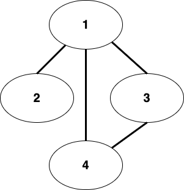
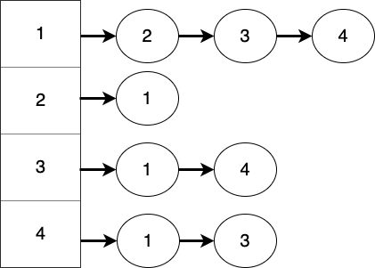

# 그래프 개념

그래프의 정의를 하나의 문장을 딱 내리기에는 애매하니, 제 성격상 그냥 트리에서 좀 더 발전한 자료구조라고만 하겠습니다.

어차피, 정의를 달달 외우고 다니는 것보다, 실제 특징들을 제대로 설명할 수 있는 게 더 중요하니깐요.

바로 아래 내용들을 보면서 어떤 개념들을 가지고 있는지 확인해봅시다.

## 방향

그래프에 있는 노드간 간선(edge)들은 방향을 가질 수도, 가지지 않을 수도 있습니다.

*(출처 : math insight)*

위와 같이 간선들이 방향을 가지는 그래프는 **directed graph**라고 합니다.

*(출처 : math insight)*

그에 반해, 위와 같이 간선들이 방향이 없는 그래프는 **undirected graph**라고 합니다.

그래서 사실, 트리도 항상 위에서 아래로 가는 방향성을 가지므로 **directed**하다고 할 수 있습니다.

하지만, 어차피 트리는 아래로 가는 방향밖에 없기 때문에 간선의 방향 표시를 생략하는 경우가 대다수입니다.

directed graph에서는 **self edge**라고 해서, 간선이 자기 자신을 가리키는 경우도 있습니다.(loop라고도 하는 것 같습니다.)

![](data:image/jpeg;base64,/9j/4AAQSkZJRgABAQAAAQABAAD/2wCEAAkGBxIRERISEhIWFRUVFhUVGBgSGRURFhYWFRIWFhgYGhgYHSggGholGxUVIjEhJSkrLi46Fx8zODMsNystLisBCgoKDg0OFxAQGDcmHyUtLS0tLS0rKy0tLS01LTI3LystLSsrLSs1LS0rNS03LS0vLTE3LTctLSstLTU1LTgvLf/AABEIALMBGQMBIgACEQEDEQH/xAAbAAEAAgMBAQAAAAAAAAAAAAAABQYCAwQHAf/EAEYQAAICAQIDBQQFBwoFBQAAAAECAAMRBCEFEjEGE0FRYRQicYEHMkJSkSNUYnKClKEkMzVDdJKisbTUFTSywfBEY5PE4f/EABYBAQEBAAAAAAAAAAAAAAAAAAABAv/EABcRAQEBAQAAAAAAAAAAAAAAAAABETH/2gAMAwEAAhEDEQA/APcYicXFeJV6et7bGCogLMT4Af5n0G5gdbOB1kXf2j0qNym5M+QPMf8ADmR+i4dbrALdWHrrbBTTZ5SFO4N5HV/0AcDpuZP6bRV1gCutUA6BQB/lA4aO0elduUXJnyJ5T/ixJNXBmnVaKq0EWVq4PUMAf85A6zh9ui/K6UPbUPr6bPOwXO7UEn6wGT3ecNjAwcZCzROPhfEa760trYMjgMrDoQf/ADpOyAiIgIiICIiAiJFcd4wmmrLsCxJCoiDmex22VEHixP8A3JwATAkrLVUZJAA8TsJFP2m0oJXvlJHXly//AE5nNpeBNdizXHnY7ilSTTX5Aj+sbzY7eQEnadOiDCqqj9EAf5QODSce01p5UuQnyzg/gd5JBszl1vDKbhiypGHqBn5HqJA6sW8OIsDPbpPt8x57NMMH38nd6emRuy9dxnAWmJq094cAgggjII3BB8czbAREQEREBERAREQEREBERAREQMXbAlXdfa9elbb16YLew8DaSwpz+rys/wAQh8JY9Y2FMr3ZBgb9cftd5V/d7lcfx5oFomLuFBJIAAJJOwAHUk+Uyla+kbRJdwzWhy3uae6wcjtXlkpcjPKRzLn7J2PjJbkWTasgM+zTov5uv9Vf+kTdNWZWZdmqtUPZdc9Y2r1AN6jysBAtA+OVb4ljLOhyJU+2/P32i7pkWzmt3sVrF5e6OdlZT15fGSGlp4gVGNRpf3a4/wD2ZFT0SG9n4h+c6X92u/3Mez8Q/OdL+7Xf7mBMxIb2fiH5zpf3a7/cx7PxD850v7td/uYEzEhvZ+IfnOl/drv9zOfiNHERTaV1GnJ5HwE01wYnlOOX+Unfy2gTtz4GZWuD1+06629t00v5CoeHe2Ir3P8AEKyID4ZsHjPO+wuq7SFV79B7Ptk633H5dvqgflM46ZGPWek9gyDp7T4nU6nm+Pftj/DywLJNGp1ldWO8sRM7DnYLk+mZvlF7Z30e2Ctaku1b6ZlA1LrXpqKGsINj82+WbbCAseTwG8iryDncQRmR3ZzR9xpaKe873u61XvOvPgYzJKavWZxVuAn2e67SfZrIaoeVVmSF+CkMB6YloBlU4o4HElx1OnHN/wDLt/3lppOwkVnERAREQEREBERAREQEREBERA0axcqZSeG6waXiQD7JqlFWfAXIWavPlzAuufMKPGXtxkSmdr+CC5GBGx8sgjyII3BB3BHSBdZhbUrqVYBlYEEMAQQRggg9QRKD2d7cGnGn4i2CNk1ODyOPDvcfzb+bfVPXbpL7RqEcBkZWB3BUhgR6EQMwMbCfZqv1CVqWd1VRuSxCgD1JlC7R9tzqM6fhxJ5sq+pAIVAevc5+u/6X1R1947QN3ENYNVxI8u6aZTVnwNrENZj9UBV+PMJddGuFE8/7CafuSumuUJaBlSM8l6+LqTvz/eU7gnO43noqDAgZREQEREBERA4uJplDKn2N1nc6zUaVthefaKvIsqqlqehwEcDxy58DLTx7iVOloe/UOErQZZiCfwABJPoJ403alOKark0VVirTm32hiEZGU4QoozuSR1O45sjrA91nFreEae5ua3T1WNjGbK0c48ssOm5/GVfs728rblp1xWi8bc5ytFvkVY7Ix+4xz5ZlzRwdwQfhvA+U0qihUUKoGAqgKAPIAbCZEzn13EKaEL3WpWo6s7BQPmZ552g7UvxAnT6QOmnO1lxBre4Z3StTutZ6FzgncAY96Bx8Q7X6erVW6y/nFLMKq3RGccteRk46czFiPMYl07IdstHxEONLYXNYUsGVkwGzjr8DOThfZyqyg0W1hq2XlKkbYx4eU5uy30cVcOrsGm1NqWPYX7wYOU37ut6zlXCgnfAPvMQVzAvESAHFdTp9tXRzoP6/SBrF+L0b2V/s94PMiS+i1tVyh6rFsU+KEMP4QOiIiAiIgIiICIiAiIgIiICaNRQGE3xAp3GezgfO0qTdjjWxNXNXk5PdM9WT5+4RvPXWUGam0ynwgeNcA7LnU6fTXXFrWeqqzNrNacvWrE++Tg7y98G7OBMbTv7C0L/wzh5x/wCk03+nSWBVAgR+p4RXbXyOPIqRsyMOjKfAic2j4i9Ni6fVH3m2qt6LdgZ5T923H2fHGR4gTU5uIaGu+tqrVDI3UHbocggjcMCAQRuCARA6YkDo9XZpWWjUsXQnlq1DdW8q7sbCzybo3oes9AREQET47AAknAG5J2AErlhs4i3KpNeiH1mGVs1f6KnqlHm3V+gwu7BnqbTr+aqv/lt1sswD3uNjXXnqvgX/AA85ydmewmm4el6UA4us5zzYJAxhUz4qu+M/eMtNVSooVQFVQAAowAB0AA6CZwKNxnsur590HMrI7INXtU1lY8qnsqG/ojAT11kBmo6VT4QPK9N2MDOHcF2HRrCbGHwLEkS5cH4AqY2ljXTqPCbQIGFNQUTZEQEi9bwGp3Nq5qtP9ZSeRj+sOj/tAyUiBCe0auj+cQahB9urCWgetZOG+R+U7uHcWpvz3bgsv1kOVdP1kbDD5ids4OJcHovwbE95fquhNdifq2KQy/IwO+JAd3rtN9VhrKvuvy06lR6OMV2+GzBD5sZ28P45Tc3ICUsHWq4Gqwfst1HqMg+BgSUT4TIri3G0pKoFay188lVWC7Y6ncgBR4sSAPOBLRmV1dJxG7d76tMp+xSntFo+Nth5PkK/mZkeB6td04laT/79OmsTPwqStsftZ9YFgiVs8X1Gl/52te7/ADjT57oetlbEtV8csvmwlgqtDAEHOYGyIiAiIgIiIEH2E/ovh39j0v8Ap0k5IPsJ/RfDv7Hpf9OknICIiBq1OnSxGR1DKwwQdwRIOvUvoWCXMW0xICXNuaSdglx+74Cz5N5ywzGysMCrAEEEEHcEHqCPKBlNd9yorO7BVUEszHAAG5JJ6CV2+/8A4WCzsToh4nLNpfTzany8V6bjpnp9I+udb9QOXTqQ9NB+2Rut1/mehWvovU5bHIGSVvryGcFNKN1Q5Vr/ACZx1FfkvU+PlLAoxsNgPKfYgIiICIiAiIgIiICIiAiIgJy6/h9V68ttauBuMjdT5qeqn1E6p8YwKvxOyzQoWW5ra8cq1We+5dsLWiP13Yge9nrJHs9wbuA1ljc+otw1th8/CtPu1r0A+JOSSZGcQPe67SVn6qtZcR5mtML+BsB+QlrgIkX2o4k2l0eovQAtXWzKGBZS3RcgEEjJHQyP7H8Zs1PeizUae1k5Pdoqu07Jzc27ra7Eg42IwNj1gWNlBBBGQdiDuCJVdPV/w/UJQpPs12e5B/qXUZNIP3CuWUeHKw6YEtcgO29f8kawfWpau0HyKOCfxGR84E6jZEynFwy3mUTtgIiICIiBB9hP6L4d/Y9L/p0k5IPsJ/RfDv7Hpf8ATpJyAiIgJycT4jXp6zZa3KoIA8WZmOFRVG7MSQABucz5xPiKUJzNkknCqu7ux6Ko8TODh3Cne0arVYNoB7qsHNemVhg8v3rSNms67lRgZyHzS8PfUMLtUuAN66Dhgn6T+DWfwHh5zVZU+gJetWfS5y1a5Z6PNqx1ZPNOo8PKWGIGrTahLEWytgyMAyspyCD0IIm2V+/RPo3a7TKWpclrqF8GO7W0jwY9WTo3Ue9nM1o9WlyLZWwZW3BH/mx9IG6IiAiIgIiICIiAiIgIiICY2dDMp8MCk67Ud1xDSOdlLvST5d6vu/iyKPmJd5TO2nC+9rZdxkbFchlI3DAjoQQCD6Tt7Gdpvak7m7C6qsYsUbBwNhag+63XH2Tkb4yQmeM6Sy6l66rO6c45X5Q4BBBGVPUHGCPXwkfwfg1qam7V6ixGtsrrpAqUoi11lm8SSWLOxz8BJ2ICVvt/qOXRlM+9c9dSjz5nHN+Chj8pYL7lRWd2CqoJJY4AA6kkzzi3iDcS1i2gEaenmWkHOXJOGuI8MgYUdQMnbmwAu3A/qCSs5OHVcqidcBERASpfSd2g1PD9CdVp0V+R0Dh84CMeXP8AeKD5yw8Q4nVQvNY4UevUnyA6k/CQXFtWdbRbp/Y73quRkLEJTswxle9I3HUHHgIHH9D2vvv4VpmuVVCqKquXxqqVa1Y+pKmXWVfhmtOjproOjvrqqRUBAS7ZRjJ7onc9SceMnNBxOq9eatww9D0PkR4GB2SO4zxZdOFHKbLbDy1VJjnsbGTjPRQN2Y7KNzKN2++lNeG66nTKi2Lyk3Ekg1lv5vBHzJGM4IxLnwHQKB7Sz97dcoJsxgch3CVg/UrHl49TkwPvC+GMG7/UEPeR9nPJUp+xWD4ebHc+nSS0RAREQEg9foLKHbUaQZJ3toyFW4eLITslvkejdDjqJyIHJwviNeorFlRyDkEEFWVhsyMp3VgdiD0nXK12pdNCtnEFYVlQDcu/Leo2AIH9YBsG+R26RH0YfSEvFhqQyCuyp8qgOc0t9UknqwIIONtx5wL5EjuJcZpoxztueijLO3wUbmci8avY+5oriPAsa6s/J2BgTkSBPaEp/P6a6ofeKixfmaycD4yW0msS1QyMGU9CpBEDoiIgIiICIiAiIgcuu0wcESgdoOzp5xZWWR1OVZDysp9CJ6TNF2mDdYHnGl7YcQowttaXgfaOan+ZGQT8p03fSHqSMV6NQfN7Cwz8Aolq1HA0bwmlOzyA9IFHvXWa9h7S+UzkVIOSvY5GR1b5y7cB4QKwNpJ6bhir4TuVcQPqjE+xEBIjtBxcaevIU2OzBK60xzWWN9VATsPEljsACTsJKWtgSs8OXv8AiDu266asBM9BZdnmb4hABn9NoHfwbgnIRdqCLdSRu3VK/wBCoH6qjz6nqZNRI3i/GqtMa1fmZ7SQiVqbHblGWOB4AdT6jzgSUhOMcELHv9MVq1C7gkHktGd67QOoP3uq5yPI9/CeJV6mpbqiSjZ6gqQVJVlZTuGBBBB6YnZAo3ZTs/oLLLNW2nJ1TWP3vtP5Wyq0H3kGcgAbAFdiOUjYy8CVjXjuOIKy7LqazzeXeVYw3xKHH7AllqbIgZxEQEREBERAxtQMCGAIPUHcH5SgcS7P6XS6yq3Q0hNbd3iKtZKVMnL+Ue1Rt3aZViRuTyDqRL3qbMKZXeytfe6jV6ptyGGmrz9musBnx5c1rNnz7tfIQJXhHBUoyxJsub69r452Pp91fJRsJJxODjnGKdHS1978qLgZ6kljgADqST4QO+V3ivCHpY6nRqA43tpHupeoB6b4S0eDdD0O2CLAjZAI6EZ/GZQOHhPEUvrWxD7rDIyMEeYIPQg5BHpO6VXQ/wAn1uopGyPy3qPAF8hwP2hn9oyXPH9MNQml75O/cMRWDlsKCSSB02B6+UCTiIgIiICIiAiIgIiICIiAiIgc+tPumVzsfcPaNcn2uep/XlaoKPllG/jLLqlyplA1Wu9g1yaltqXHc3nwVCcpYfRW6+Qdj4QPRZX+1Ot7o1Bqb2rcOrXaVXttob3Svu1qXCtgjmA8BnrJ9WBAIOQdwRuCJ9gVr6O9NZVoVSxXX8pcyd8OW01tczI1o8LCDkg75MssTF3ABJIAAySdgAOpJgVbtdcPadEnjm1/XlCcv4ZYSx6I+6JQ9Jrvbta+oXepR3VPkyA5az9punoqnxl+0y4UQN0REBERAREQOHip9wyH7AWg0XL4pqtQG88vYbRn9mxf4Sb4jXlTKRwXiHsWvdLDinVcoydgmoQBVz5B0wuT41qPGB6FKP8ASFwPV3iy2o1WJXprVSl1sdxa6sGsQId35PdXIOMt5y8RCyuXhgsFNYt5e85RzcgIXOPANv8AjOqJo12rSmt7bWCIgLMzbAAS27WZMmKd2nq7/XNStj1n2YKXqIDrz2EjBIIBwD4SvcK+hpadZXqk11jKGyy2A94wIIP5VGBB9cSZ7NO+pvt1Tgg2tlVP2a12QehxufVjL7UMASKi+A32A26e1uZ6WGGPV6n3Rjud8ZUnx5c+Ml5DW+5xCsgfztDg/GtwR/BzJmAiIgIiICIiAiIgIiICIiB8Ilb7RcKFinaWWYWVgwPL+Fcd1PDPyRrN+mB2QEC2oeVZbZl/QJGPA+EtWj+kLhrj3tSKT4rqQ2nIPxsAB+IJHrOviXBFfwld1PZIE9IEvrPpC4bWPd1AuPgumDagk/FAVHxJA9ZVOK8b1PFPyXdmjTHqhIay0eVhXZV/QUnPiT0kppuyQB6Sx8N4IqeEDR2d4UK1G0sYExrrAmcBERAREQEREDF1yJT+1XBBarAjIMuU1XUhhA834R2v1GhxTqq31FQ2WxCDcg8AytgWAeYPN6GWfTdv+GOATrK6/S/Ombb9G0KZnxLgCv4Sl29lw+uKAbU0Bj+tqLSF+YGnb+9AtWv+kbh9Y/J2NqG8F0ytZn9vatfmwlW1eq1XFLFNyiulSGShTzjmByHsbA52G2BjA9TvJnSdlAD0ll4dwhU8IGPA+H92o2k1MUXEygRHEc+16PHlfn4ci/8A5JeQtf5TXsR0oq5PTntbmI/uqPxk1AREQEREBERAREQEREBERAREQExKDymUQMQg8plEQEREBERAREQEREBERASA4dheIaxG+tYlFqZ+1WqtUwHnyuu/l3i+cn5G8a4Ybgj1v3d1RLVPjIBIwysPtVsNiPgeoBgSIUT7IjRcdQsKrwKLvuOcK/rW52cfDfzAkjqtXXUOayxEHm7BB+JMDdOPi3EV09RsbJOwVV3Z3bZUUeJJwJwnj4s20tbXn7+9dI9TYw94fqgzPQcIPee0ah+8uxhcZFdQ32rU+Jycsdz02G0DdwHQtVV+UObbCbLSOnO3UD9FRhR+rJGIgIiICIiAiIgIiICIiAiIgIiICIiAiIgIiICIiAiIgIiICIiAiIgadXpK7VKWIrqequA4PyM4tN2d0dbBq9JQjDoVqrUj5gT5ECTAn2IgIiICIiAiIgIiICIiAiIgIiIH/9k=) (출처 : ycpcs.github.io)

## 순환

그래프에서는 순환(cycle)이라는 개념이 있는데 노드간 간선으로 인해 하나의 cycle을 만들 수 있으면 cyclic graph, 만들 수 없다면 acyclic graph라고 합니다.

*(출처 : study.com)*

위 그래프에서는 노드 B-C-E-D에서 cycle을 형성하므로 **cyclic graph**라고 할 수 있습니다.

*(출처 : study.com)*

그에 반해 위 그래프는 cycle이 없으므로 **acyclic graph**입니다.

얼핏 보면 노드 B-C-E-D가 cycle을 형성하는 것처럼 보이지만, 간선의 방향을 잘 보시면 B에서 뻗어나간 간선들이 다시 B로 돌아오는 케이스가 없습니다.

위에 예시로 붙여넣은 cyclic graph는 B에서 출발하여 C &rarr; E &rarr; D 경로를 거쳐 다시 D에서 B로 오기 때문에 cyclic graph입니다.

그러나 acyclic graph의 예시 이미지는 B에서 출발하여 C와 D와 E로 가고, C와 D는 무조건 E, E는 무조건 F로만 가므로 다시 B로 돌아오지 않으니, cyclic graph라고 할 수 없습니다.

따라서, cyclic graph인지 판별할 때는 간선의 방향도 유심히 살펴보아야 합니다.

**여기서, 하나 더 첨언하자면 트리는 부모-자식 관계만 성립하기에 절대 사이클이 생길 일이 없습니다. 따라서, acyclic graph의 한 종류라고 할 수 있을 것 같습니다.**

## 노드간 연결 관계 표현 방법

그래프의 노드간 연결 관계를 표현하는 방법에는 **adjacency matrix**, **adjacency list**가 있습니다.

adjacency matrix는 노드 간의 연결 관계를 2차원 배열을, adjacency list는 링크드리스트를 이용해 표현하는 방법입니다.

### Adjacency Matrix

위와 같은 그래프가 있을 때, 이 그래프의 노드간 연결 관계를 2차원 배열을 이용하여 표현하는 방법입니다.

2차원 배열 요소들에 노드가 서로 연결되어 있으면 1(true), 연결되어 있지 않다면 0(false)로 값을 넣어줍니다.

위 그래프의 adjacecny matrix는 아래와 같습니다.

|       |  1   |  2   |  3   |  4   |
| :---: | :--: | :--: | :--: | :--: |
| **1** |  0   |  1   |  1   |  1   |
| **2** |  1   |  0   |  0   |  0   |
| **3** |  1   |  0   |  0   |  1   |
| **4** |  1   |  0   |  1   |  0   |

여기서 중요한 점은 adjacency은 인접을 뜻합니다.

2와 3은 서로 1을 거치면 연결되어 있다고 볼 수 있지만, connection matrix가 아닌 adjacency matrix이므로 간선 하나를 통해서만 연결되어 있을 때만 1로 표시하고, 아닌 경우에는 모두 0으로 표시합니다.

### Adjacency List

adjacency list는 노드의 개수만큼 링크드리스트 배열을 만들어서, 각 노드에 해당하는 배열 방의 링크드리스트에 인접한 노드들을 추가하는 것입니다.

똑같이 위와 같은 그래프가 있을 때, 이를 adjacency list로 표현하면 아래와 같습니다.

이렇게 노드별로 각 배열 방이 있고, 이 배열은 링크드리스트 배열입니다.

각 배열 방은 링크드리스트이므로 해당 노드와 인접해있는 노드들을 모두 링크드리스트에 추가해줍니다.

1은 2, 3, 4와 인접해있으므로 1의 링크드리스트에는 2, 3, 4가 들어가있고,

2는 1과 인접해있으므로 2의 링크드리스트에는 1만 들어가있습니다.

여기서 특징 하나는, 모든 배열 방(링크드리스트)에 들어가 있는 요소의 갯수는 그래프의 간선 갯수의 2배라는 것입니다.(그래프의 간선 갯수를 m이라 하면, 링크드리스트에 들어간 모든 요소의 갯수는 2m)

이 이유는 그래프 상에서는 1과 2를 연결하는 간선을 표현할 때 하나만 이용하지만, 실제 링크드리스트에 추가할 때는 1의 링크드리스트에 2를 넣고, 2의 링크드리스트의 1을 넣기에 2번씩 들어가기 때문입니다.