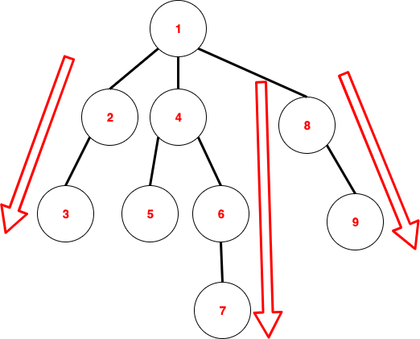
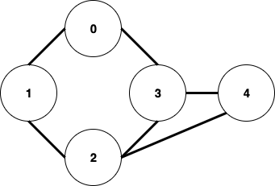
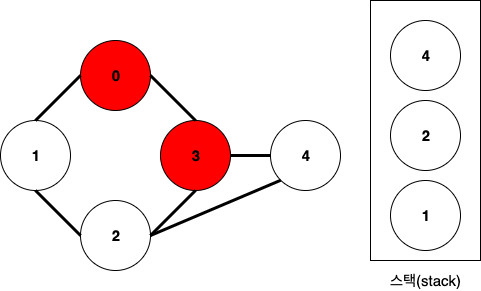
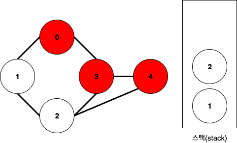
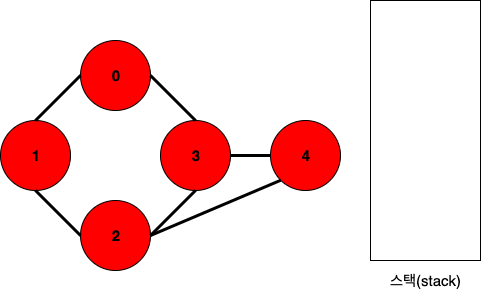

그래프의 순회 방법에는 DFS, BFS가 있습니다.

그 중 먼저 DFS(Depth-First Search, 깊이 우선 탐색)에 대해 알아보겠습니다.

## DFS - 깊이 우선 탐색

### 개념

깊이 우선 탐색은 말 그대로 깊이를 우선으로 하여 탐색하는 방법입니다.

아래 그림을 통해 이해하는 것이 쉬울 것 같습니다.

(노드 안에 있는 숫자는 제일 윗쪽 노드부터 깊이 우선 탐색을 한다고 가정했을 때의 방문 순서입니다.)

위 이미지로 확인할 수 있듯이, 깊이 우선 탐색은 자신과 연결된 노드를 방문하는데 이 때, 제일 아랫쪽까지 방문하고 다음 줄기로 넘어가는 것이 특징입니다.

2를 먼저 방문하는데 2와 연결된 노드들의 제일 아랫쪽 노드(3)까지 방문하고 그 다음 4로 이동합니다.

4를 방문하고 제일 아랫쪽 노드(7)까지 방문하고 8로 이동합니다.

### 구현 방법

깊이 우선 탐색은 스택(stack)을 이용하여 구현합니다.

위와 같은 그래프가 있을 때, 깊이 우선 탐색을 구현하는 방법은 아래와 같습니다.

1. 0부터 깊이 우선 탐색을 한다고 했을 때, 먼저 0을 방문하고, 0과 연결된 노드들을 스택에 넣어줍니다.

   

2. 그 다음 스택에서 노드를 하나 pop하고 방문한 뒤, 해당 노드와 연결된 노드들을 스택에 넣어줍니다.

   여기서는 3을 pop하고, 2와 4를 새롭게 스택에 넣습니다.

   

   현재, 0-3까지 방문을 완료한 상태입니다.

3. 똑같이 스택에서 노드를 하나 pop하고 방문한 뒤, 해당 노드와 연결된 노드들을 스택에 넣어줍니다.

   여기서는 4를 pop하고, 4와 연결된 3과 2를 스택에 넣어주려 하지만 3과 2는 이미 스택에 들어갔었던 노드이므로 무시합니다.

   **"한번 스택에 들어갔었던 노드는 다시 스택에 넣지 않는다"**가 DFS 구현의 핵심입니다.

   

   현재, 0-3-4까지 방문을 완료한 상태입니다.

4. **3번 과정**을 반복합니다.

   여기서는 2를 pop하고, 2와 연결된 1, 3, 4는 이미 스택에 들어갔었던 노드이므로 무시합니다.

   

   현재, 0-3-4-2까지 방문을 완료한 상태입니다.

5. **3번 과정**을 반복합니다.

   여기서는 1을 pop하고, 1과 연결된 0, 2는 이미 스택에 들어갔었던 노드이므로 무시합니다.

   

   현재 0-3-4-2-1까지 방문을 완료한 상태입니다.

6. **3번 과정**을 반복하려 하지만 스택이 비어있으므로 탐색을 종료합니다.

이제 이 방법을 그대로 코드로 옮겨보도록 하겠습니다.

### 구현

전체 코드는 [이 곳](https://github.com/SongKJ00/data-structure-study/blob/master/graph/graph_dfs_bfs.cpp)에서 확인할 수 있습니다.

* Node 클래스

  ~~~c++
  class Node
  {
  public:
    int data_;                    // 노드가 가지고 있는 데이터
    std::list<Node*> adjacent_;   // 인접한 노드 정보를 담고 있는 링크드리스트
    bool marked_;                 // 큐 or 스택에 들어갔었는지 여부
  public:
    // 생성자
    // 인자로 온 data로 data_를 초기화하고, marked_는 false로 초기화
    Node(int data) :
    data_(data), marked_(false)
    {
    }
  };
  ~~~

* Tree 클래스

  ~~~c++
  class Graph
  {
  public:
    std::vector<Node*> nodes_;  // node들을 담고 있는 vector
  public:
    // 생성자
    // 인자로 온 size만큼 nodes_를 resize하고, 0부터 size-1까지의 데이터들을 가지는 노드들을 만듦
    Graph(int size)
    {
      nodes_.resize(size);
      for(int i = 0; i < size; i++)
      {
        nodes_[i] = (new Node(i));
      }
    }
   
    // 간선 생성
    // 인자로 오는 노드의 인덱스 n1, n2에 해당하는 노드끼리 서로 링크드리스트에 추가
    void AddEdge(int n1, int n2)
    {
      nodes_[n1]->adjacent_.push_back(nodes_[n2]);
      nodes_[n2]->adjacent_.push_back(nodes_[n1]);
    }
    
    // 노드 방문
    // 노드의 데이터를 출력
    void visit(Node* node)
    {
      std::cout << node->data_ << " ";
    }
  }
  ~~~

* DFS 함수 - Tree 클래스 멤버 함수

  ~~~cpp
  void dfs(int start)
  {
    std::stack<Node*> s;  // 방문할 노드들을 담아놓는 스택
    
    // 맨 처음 방문할 노드와 인접한 노드들을 스택에 넣고, 맨 처음 노드를 방문
    Node* root = nodes_[start];
    root->marked_ = true;
    for(auto n: root->adjacent_)
    {
      s.push(n);
      n->marked_ = true;
    }
    visit(root);
  
    // 스택이 빌 때(empty)까지 반복
    while(!s.empty())
    {
      // 스택에서 노드를 pop
      Node* node = s.top();	
      s.pop();
      // 인접한 노드들이 아직 스택에 들어간 적이 없으면 스택에 push
      for(auto n: node->adjacent_)
      {
        if(n->marked_ == false)
        {
          s.push(n);
          n->marked_ = true;
        }
      }
      // pop한 노드 방문
      visit(node);
    }
  
    std::cout << std::endl;
  }
  ~~~

* 사용 방법 - main 함수

  

  위와 같은 형태의 그래프를 만들고 깊이 우선 탐색을 진행해보았습니다.

  ~~~cpp
  int main(void)
  {
    /*
     *   0
     *  /
     * 1 -- 3    7
     * |  / | \ /
     * | /  |  5
     * 2 -- 4   \
     *           6 - 8
     */
    Graph g(9);
    g.AddEdge(0, 1);
    g.AddEdge(1, 2);
    g.AddEdge(1, 3);
    g.AddEdge(2, 3);
    g.AddEdge(2, 4);
    g.AddEdge(3, 4);
    g.AddEdge(3, 5);
    g.AddEdge(5, 6);
    g.AddEdge(5, 7);
    g.AddEdge(6, 8);
  
    std::cout << "DFS" << std::endl;
    g.dfs(0);	// 0부터 방문
  }
  ~~~

* 출력 결과

  ~~~bash
  DFS
  0 1 3 5 7 6 8 4 2
  ~~~

  1. 0 &rarr; 1 &rarr; 3 &rarr; 5 순서로 이동해가면서 방문합니다.
  2. 5 &rarr; 7을 방문하고 다시 5 &rarr; 6 &rarr; 8 순서로 방문합니다.
  3. 5와 연결된 모든 노드들의 방문을 마치고 났으니 3과 연결된 나머지 노드 4와 2를 방문합니다.