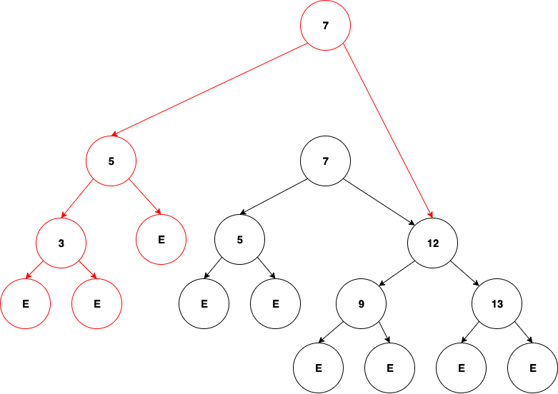

layout: single
classes:
  - wide
title: Scala - Class Hierarchies
comments: true
author_profile: true
tags:
  - scala

[이 강의](https://www.coursera.org/lecture/progfun1/lecture-3-1-class-hierarchies-sqr2n)를 보고 정리한 글입니다.

### Abstract Classes

정수의 집합(sets of integers)에 대한 클래스를 정의해보겠습니다.
파라미터로 들어온 x를 추가한 IntSet 객체를 return하는 `incl` 메소드와 파라미터로 들어온 x가 현재 객체에 존재하는지 Boolean을 return하여 알려주는 `contains` 메소드를 가지고 있습니다.

~~~scala
abstract class IntSet {
  def incl(x: Int): IntSet
  def contains(x: Int): Boolean
}
~~~

`IntSet`은 추상 클래스(abstract class)이므로 구현을 뺴놓은 멤버들(여기서는 `incl`, `contains` - '='으로 시작하는 본문(body)이 없음)을 가지고 있을 수 있습니다.
그리고, 추상 클래스로는 new 연산자로 인스턴스(객체)를 생성할 수 없습니다.

만약 `abstract class IntSet` 라인에서 abstract 키워드를 지운다면, `incl`와 `contaions` 메소드를 정의하라는 에러 메세지가 출력될 것입니다.

그렇다면 이렇게 새로운 인스턴스(객체)를 만들어 낼 수도 없는 추상 클래스는 왜 사용하는 것일까요?

### Class Extensions

이진 트리를 구현한다고 가정해봅시다.

이진 트리에 구현에 있어서 두 가지의 유형이 있을 것입니다.
첫 번째는 값이 없는 트리(a tree for the empty set), 두 번째는 값이 있고 두 개의 서브 트리를 가지는 트리(a tree consisting of an integer and two sub-trees)입니다.

예로 아래와 같은 트리 구조를 들 수 있습니다.
예로 들은 트리 구조가 이진 탐색 트리(binary search tree)입니다.
여기서 `E`는 값이 없는 노드(empty)를 나타냅니다.

<pre>
       7
    &swarr;    &searr;
   5       12
 &swarr;  &searr;    &swarr;   &searr;
E    E  9      13
      &swarr;   &searr;  &swarr;   &searr;
     E     E E      E
</pre>

그럼 먼저 값이 없는 트리(a tree for the empty set) 클래스를 Empty라고 하고 구현해보겠습니다.
Empty 클래스는 추상 클래스인 IntSet을 extends해서 구현할 수 있습니다.

~~~scala
class Empty extends IntSet {
  def contains(x: Int): Boolean = false
  def incl(x: Int): IntSet = new NonEmpty(x, new Empty, new Empty)
}
~~~

값이 없는 트리는 자기 자신의 값과 서브 트리가 없기 때문에 x가 트리에 포함되어 있는지 나타내는 `contains` 메소드는 항상 false를 return하게 구현하는 것이 맞을 것입니다.
또한, x를 트리에 새롭게 추가하여 새로운 IntSet을 return하는 `incl` 메소드의 구현은 x를 자기 자신의 값(현재 트리 루트 노드의 값)으로 두고 양 옆 서브 트리는 Empty로 두는 NonEmpty 객체를 return하도록 구현하는 것이 맞을 것 같습니다.

값이 있고 두개의 서브 트리를 가지는 트리인 NonEmpty 클래스의 구현은 아래와 같이 할 수 있습니다.

~~~scala
class NonEmpty(elem: Int, left: IntSet, right: IntSet) extends IntSet {
  def contains(x: Int): Boolean = 
    if (x < elem) left contains x
    else if (x > elem) right contains x
    else true
  
  def incl(x: Int): IntSet = 
    if (x < elem) new NonEmpty(elem, left incl x, right)
    else if (x > elem) new NonEmpty(elem, left, right incl x)
    else this
}
~~~

NonEmpty의 `contains` 메소드 구현같은 경우, recursive하게 동작하는 구조로, 이진 탐색 트리이기 때문에 x가 현재 값(루트 노드 값)보다 작으면 계속 왼쪽으로 이동, 크면 오른쪽으로 이동하고 만약 값이 같으면 true를 return하도록 구현합니다.

incl 메소드 구현같은 경우 또한 recursive하게 동작하는 구조로, x가 현재 값보다 작으면 자신보다 왼쪽에 배치, 크면 자신보다 오른쪽에 배치하고 값이 같으면 현재 트리 자체를 return합니다.

### Persistent data structure

그러나 이러한 구현은 트리의 이전 요소를 포함하는 새 트리를 만듭니다.
예를 들어, 위에서 예로 들었던 트리에서 노드 7에 새로운 노드인 3을 추가한다고 하면 아래와 같은 구조가 됩니다

기존 트리 7 -> 5에 3을 붙이는 것이 아닌, 새롭게 7->5를 생성하고 그 밑에 3을 붙입니다.

먼저, 두 개의 Empty를 서브트리로 두는 NonEmpty 3을 만듭니다.
그 다음. 새로운 NonEmpty 5를 만들고 왼쪽 하위 트리로 NonEmpty 3을, 오른쪽 하위 트리로는 Empty를 가집니다.
그리고 마지막으로 새로운 NonEmpty 7을 만들고 왼쪽 하위 트리로 NonEmpty 5를, 오른쪽 하위 트리로는 기존 12를 가집니다.

기존 트리와 새로운 트리는 오른쪽 하위 트리(12가 루트 노드인)를 공유하지만 왼쪽 하위 트리는 서로 다릅니다.

이러한 데이터 구조를 영구 데이터 구조(persistent data structure)라고 합니다.

영구 데이터 구조라고 부르는 이유는 데이터 구조를 변경할 때 예전 버전의 데이터 구조가 유지되기 때문입니다.

### Base Classes and Subclasses

`IntSet`은 `Empty`와 `NonEmpty`의 superclass이고 `Empty`와 `NonEmpty`는 `IntSet`의 subclass입니다.

scala에서 유저가 정의한 모든 클래스는 다른 클래스를 확장(extends)합니다.

하물며, superclass를 명시하지 않아도(extends 키워드를 코드에 작성하지 않아도) Java 패키지 `java.lang`의 표준 클래스인 `Object`가 superclass로 사용됩니다.

따라서, `NonEmpty`의 경우도 base class는 `IntSet`과 `Object`가 됩니다.

### Implementation and Overriding

추상 클래스 `IntSet`에 정의되어 있던 추상 함수(abstract function) `contains`와 `incl`를 subclass인 `Empty`와 `NonEmpty`에서 구현했습니다.

여기에 더불어, superclass의 비추상 함수(non-abstract function)을 subclass에서 `override`를 이용하여 재정의할 수 있습니다.

예제로 superclass `Base`의 비추상 함수 `foo`와 추상 함수 `bar`를 subclass `Sub`에서 각각 재정의와 구현할 수 있습니다.

~~~scala
abstract class Base {
  def foo = 1
  def bar: Int
}

class Sub extends Base {
  override def foo = 2  // redefine
  def bar = 3           // implement
}
~~~

### Object Definitions

위 `IntSet` 예제에서, `Empty` 객체는 굳이 여러 개일 필요가 없습니다.

여러 개를 만들 수야 있긴 하지만, 무수히 만들어낸 Empty 객체들끼리 서로 다른 속성을 가진 것도 아닙니다.

이 경우를 해결하기 위해 scala에는 object definition이라는 게 있습니다.

~~~scala
object Empty extends IntSet {
  def contains(x: Int): Boolean = false
  def incl(x: Int): IntSet = new NonEmpty(x, Empty, Empty)
}
~~~

위 예제는 `Empty`라는 이름의 **singleton object**를 생성합니다.

더 이상 다른 Empty 인스턴스를 만들어 낼 수 없게 됩니다.

singleton object는 value로 취급되기 때문에 `Empty`도 이제  Empty 자체로 평가(evaluate)됩니다.(Empty에 대한 평가 단계가 없어집니다.)