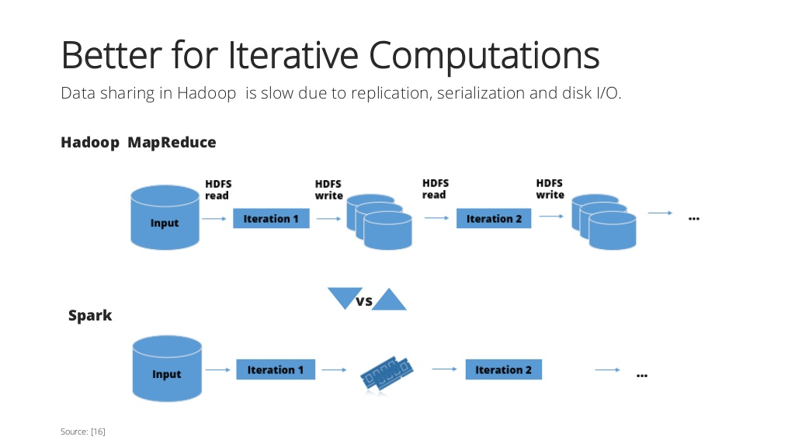

[이 강의](https://www.coursera.org/lecture/scala-spark-big-data/evaluation-in-spark-unlike-scala-collections-0GZV7)를 보고 정리한 글입니다.

이번 포스팅에서는 spark에서의 평가(evalutaion)에 대해 알아보고 scala 컬렉션과 다른 이유를 알아보겠습니다.

### Spark가 Data Science에 효율적인 이유

Spark의 주요 특징을 다시 한 번 살펴보자면 아래와 같습니다.

* Transformation과 Action
  * lazy한 transformation과 eager한 action이 있기에 [이전 글](https://songkj00.github.io/spark-rdd-transformation-and-action/)에서 spark를 이용함에 따라 어떤 이익을 얻을 수 있는지 언급했었습니다.
  * 이전 글의 **Benefits of Laziness for Large-Scale Data** 부분에 설명되어있습니다.
* In-memory computation
  * 너무 많은 latency는 데이터 처리에 있어서 너무 많은 시간을 낭비하게 됩니다. 그러나 스칼라에서는 최대한 많은 데이터들을 메모리에 적재해두기 때문에 low-latency 작업이 가능합니다.

대부분의 Data Science 작업들은 반복(iteration)을 포함합니다.

그렇다면 spark의 특징인 transformation과 action 그리고 in-memory computation은 반복을 포함한 data science에 어떤 영향을 미칠까요?

### Example - Hadoop

Hadoop에서의 반복(iteration)을 예로 들어보겠습니다.

Hadoop에서는 Input에 대한 데이터에 대해 처리하고 그 다음 iteration을 위해 중간 데이터를 write합니다.

그 다음 iteration은 write되어 있던 중간 데이터를 read하여 처리한 뒤 다시 write합니다.

그러면 또 그 다음 iteration에서 이전 iteration에서 write한 중간 데이터를 read하고 사용하게 됩니다.

여기서 Hadoop의 문제점은 **이 중간 데이터에 대한 read/write가 HDFS(Hadoop File System)에서 일어난다는 점입니다.**

HDFS에서 read/write하는 것은 메모리에서 read/write하는 것보다 IO 시간이 훨씬 더 걸리게 되므로 매우 큰 latency가 요구됩니다.

그러나, spark에서는 이 hadoop에서의 문제점이 발생되지 않습니다.

spark에서는 iteration의 중간 데이터들을 file system에 read/write하지 않고 메모리에서 모든 처리(in-memory computation)를 하기 때문입니다.

아래 사진이 위 얘기에 대한 간략한 정리가 될 것 같습니다.

출처 : [링크](https://www.slideshare.net/Ole1234/spark-vs-hadoop)

### Transformation과 Action의 Side Effect

무턱대고 transformation과 action을 남발하다간 테스크에 대한 처리 시간이 늘어날 수 있습니다.

아래와 같은 예를 들어보겠습니다.

~~~scala
val lastYearLogs: RDD[String] = ...
val logsWithErrors = lastYearLogs.filter(_.contains("ERROR"))
val firstLogsWithErros = logsWithErrors.take(10)
~~~

작년 로그들을 RDD[String] 타입으로 들고 와서 ERROR라는 문자열이 포함된 로그들만 filter로 걸러내고, 그중 맨 처음 10개의 로그들만 가지고 옵니다.

여기서 `filter`는 transformation, `take`는 action입니다.

이전 글인 [Spark - RDD, Transformation and Action](https://songkj00.github.io/spark-rdd-transformation-and-action/)에서 언급했듯이, transformation은 바로 실행되는 게 아니라 action이 수행될 때 실행됩니다.

따라서 위 예제도 `take` action이 수행될 때 `filter` transformation이 수행됩니다.

그렇다면, `take` action 뒤에 ERROR 로그들의 개수를 세는 `count` action을 추가해보겠습니다.

~~~scala
val lastYearLogs: RDD[String] = ...
val logsWithErrors = lastYearLogs.filter(_.contains("ERROR"))
val firstLogsWithErros = logsWithErrors.take(10)
val numErrors = logsWithErrors.count()
~~~

이 코드에서는 뭐가 문제일까요?

단순히 action 하나 추가했을 뿐인데 문제 될 게 있을까요?

**정답은 바로 transformation이 두 번 수행된다는 점입니다.**

 transformation은 action이 수행될 때마다 같이 수행됩니다.

위 예제에서는 `take` action이 수행될 때, `filter` transformation이 수행되고, `count` action이 수행될 때, `filter` transformation이 또 한 번 수행됩니다.

만약 `count`나  `take` action이 300번 도는 iteration 안에 있었다면, transformation도 300번 수행되게 되는 것입니다.

이런 상황은 엄청난 computing 시간을 야기할 것입니다.

그렇다면 이런 상황을 피할 방법이 있을까요?

### Caching and Persistence

다행히도, spark에서는 이와 같은 문제 상황을 해결하기 위해 RDD를 memory에 cache할 수 있게 합니다.

따라서 굳이 매번 transformation이 수행되도록 할 필요가 없고, 단지 RDD를 memory에 cache하여, action이 수행될 때마다 메모리에 있는 RDD를 reuse하기만 하면 됩니다.

spark에서 RDD를 memory에 cache하기 위해서는 `persist()`나 `cache()` 함수를 사용하면 됩니다.

이 함수들은 RDD가 evaluate되면 RDD를 memory에 cache합니다.

그렇다면 위에서 얘기한 예제를 아래와 같이 바꿔서 사용할 수 있습니다.

~~~scala
val lastYearLogs: RDD[String] = ...
val logsWithErrors = lastYearLogs.filter(_.contains("ERROR")).persist()  // persist() 추가
val firstLogsWithErros = logsWithErrors.take(10)
val numErrors = logsWithErrors.count()
~~~

persist를 사용함으로써, logsWithErrors  RDD는 메모리에 저장되고, `take`와 `count` 액션 때 `filter`가 recompute될 필요가 없어집니다.

단지 메모리에 있는 logsWithErrors를 재사용(reuse)하기만 하면 됩니다.

### cache()와 persist()의 차이

Spark에서 제공하는 RDD를 memory에 caching하는 두 개의 함수 cache()와 persist()에는 차이점이 있습니다.

spark에서 RDD를 저장할 때 메모리 말고도 disk에 저장하는 것도 지원합니다.

data set을 저장하는 방법(storage level)들은 아래와 같습니다.

* memory에 저장 - 일반적인 Java object의 형태로
* disk에 저장 - 일반적인 Java object의 형태로
* memory에 저장 - serialized Java object의 형태로(크기가 더 작아짐)
* disk에 저장 - serialized Java object의 형태로(크기가 더 작아짐)
* **memory와 disk 모두에 저장**
  * 메모리의 크기가 충분하지 않은 경우에 사용됩니다.
  * 저장하려는 RDD의 크기가 메모리의 허용된 크기를 넘어버리는 경우, RDD를 허용된 크기만큼만 메모리에 저장되는데, 저장되지 않는 RDD에 대해서는 action이 수행될 때마다 transformation이 다시 수행되게 됩니다.
  * 만약 computing 시간이 오래 걸리는 transformation인 경우, 메모리에 저장하지 못하는 RDD 부분을 disk에 저장하고 re-compute를 배제하는 게 효율적일 수 있기에 spark에서는 이 모드를 지원합니다.

이와 같은 방법들이 있지만 이 방법들을 선택하여 사용할 수 있는 건 오직 `persist` 뿐입니다.

`persist`는 파라미터로 이 방법들 중 하나를 선택할 수 있지만, `cache`는 파라미터를 받지 않고, `memory에 저장 - 일반적인 Java object의 형태로` 방법만 가능합니다.

이 방법들과 각 특징들을 표로 정리하면 아래와 같습니다.

| Level               | 사용 공간 | CPU 사용 시간 | 메모리 사용 | Disk 사용 |
| ------------------- | --------- | ------------- | ----------- | --------- |
| MEMORY_ONLY         | High      | Low           | Y           | N         |
| MEMORY_ONLY_SER     | Low       | High          | Y           | N         |
| MEMORY_AND_DISK     | High      | Medium        | Some        | Some      |
| MEMORY_AND_DISK_SER | Low       | High          | Some        | Some      |
| DISK_ONLY           | Low       | High          | N           | Y         |

MEMORY_ONLY_SER의 경우 MEMORY_ONLY보다 사용 공간은 적지만, serialize/deserialize에 많은 시간이 소모됩니다.

### Spark RDD와 Scala Collection의 차이점

Spark RDD와 Scala Collection의 차이점은 아래와 같습니다.

첫 번째로, RDD에서는 Scala Collection과 다르게 지연 연산(deferred semantics)-transformation을 제공합니다.

이는 Scala Collection과 매우 다른 특징입니다.

두 번째로, RDD는 cache function을 제공합니다.

이는 transformation이 여러 번 evaluate되는 걸 방지하기 위해서입니다.