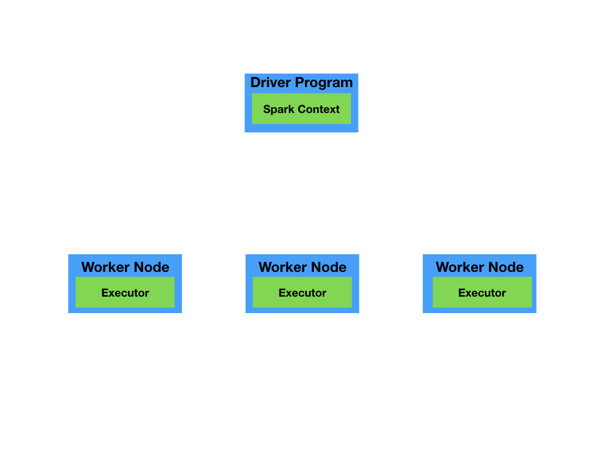

[이 강의](https://www.coursera.org/lecture/scala-spark-big-data/cluster-topology-matters-MORSy)를 보고 정리한 글입니다.

이번 포스팅을 통해 Spark가 돌아가는 cluster는 일반적으로 어떻게 구성되어 있는지 알아보도록 하겠습니다.

spark는 master worker topology로 구성되어 있습니다.

spark를 사용할 때는 데이터가 여러 곳에 분산되어 존재한다는 것을 인지해야 합니다.

그리고 같은 연산(operation)이어도 모든 worker에 걸쳐 실행되는 것도 인지해야 합니다.

### 기본적인 spark 구조

Spark는 driver program으로서 master가 있고, worker로서 worker node들이 있습니다.

driver program은 spark context가 있는 곳이고, spark context는 새로운 RDD를 생성합니다.

`sc.parallelize()`나 `sc.textfile()`와 같은 코드는 driver program 안에 있는 spark context를 사용하는 것입니다.

spark 프로그램을 작성하는 것은 결국 driver node를 중점으로 사용하는 것이고, driver node는 worker node들에게 일종의 커맨드들을 보내는 것입니다.

다시 한번 정리하자면, driver program은 우리가 spark program을 작성할 때, user level과 상호 작용(interactive)하는 node이고, worker node는 실제 작업(job - 연산 및 데이터 저장)을 수행하는 node입니다.

driver program은 작업들을 직접 수행하진 않지만, 작업들을 조직합니다.

### Driver Program과 Worker Node의 소통 방법(How do they communicate?)

그렇다면, driver program과 worker node는 서로 어떻게 소통할까요?

바로 중간에 cluster manager라는 것을 통해 소통합니다.

 cluster manager는 수행되는 작업들에 대한 스케줄링과 cluster 전반에 대한 자원 관리를 담당합니다.

유명한 cluster manager로는 YARN, Mesos 등이 있습니다.

### 각 파트별 특징

#### Driver Program

* master node라고 불릴 수 있는 driver program은 모든 프로세스들을 조직합니다.

* `main()` 함수의 프로세스를 수행합니다.
* SparkContext를 생성하고, RDD를 생성합니다.
* transformation과 action을 저장해두거나 전송합니다.

이와 같은 작업들을 하기 때문에 driver program을 Spark Job의 brain이라고 합니다.

#### Worker Node

* 내부 executor가 연산을 수행하고 데이터들을 저장합니다.
  * application의 task(연산)들을 실행합니다.
  * 연산 결과를 driver에 전송합니다.
  * RDD를 저장하기 위한 저장 공간을 제공합니다.

### Spark 프로그램의 실행 과정

spark 프로그램의 실행 과정을 간략하게 요약하자면 아래와 같습니다.

1. driver program이 SparkContext를 생성하며 spark application을 실행합니다. 
2. SparkContext가 자원들을 할당하는 역할을 하는 cluster manager에 연결합니다.
3. Spark가 cluster에 있는 노드들의 executor를 수집합니다. 이 executor는 연산을 수행하고 데이터들을 저장합니다.
4. driver program이 executor들에게 application code를 전송합니다.
5. SparkContext가 executor들에게 실행할 task를 전송합니다

### Example - A Simple `println`

RDD의 모든 요소에 대해 println을 수행하는 예제를 살펴보겠습니다.

~~~scala
case class Person(name: String, age: Int)
val people: RDD[Person] = ...
people.foreach(println)
~~~

이 때, driver program에서는 아무런 결과(people에 대한 출력 결과)도 나오지 않습니다.

그 이유는 `foreach`가 action이기에 driver가 아닌 executor에서 바로 실행되기 때문입니다.

그러므로, println의 동작은 worker node들의 stdout에서 일어나기에 driver node의 stdout에서는 출력 결과를 확인할 수 없게 됩니다.

### Example - A Simple `take`

이번에는 RDD의 요소 중 맨 앞 10개만 가져오는 `take` action 예제에 대해 살펴보겠습니다.

~~~scala
case class Person(name: String, age: Int)
val people: RDD[Person] = ...
val first10 = people.take(10)
~~~

이 때, `first10`은 어디에 존재할까요?

바로, driver program입니다.

일반적으로, action은 driver program이 worker node로부터 데이터를 받는 것까지 포함합니다.

결국, executor에게 `take` computation을 수행하라고 명령하고, 그 결과를 driver node에게 돌려달라고 요청하게 되는 것입니다.

### Conclusion

RDD를 효율적으로 사용하기 위해서는 Spark가 밑단에서 어떻게 돌아가는지 이해하는 것이 중요합니다.

API에는 eager한 것도 있고 lazy한 것도 있기 때문에, 실제 코드가 cluster의 어느 부분에서 돌아갈 지 파악하는 건 대충 봐서는 어렵습니다.

예로, transformation은 queue에 저장되고 action이 수행될 때 queue에 있던 transformation들이 driver program에 의해 최적화됩니다. 그리고 최적화된 연산이 worker node에 전송되고, worker node는 driver node에게 연산 결과를 돌려줍니다.

위의 예제에서도 봤지만, foreach 같은 것도 어느 부분에서 실행될 지 알아야 합니다. foreach에 println을 넣어 RDD 요소의 출력 결과를 모니터에서 확인하고 싶었다면, 이는 잘못된 생각일 것입니다.

왜냐하면 foreach는 action이기에 worker node에서 실행되기 때문입니다.

따라서 코드가 cluster의 어느 부분에서 실행될 지 파악하는 것은 매우 중요합니다.

결국, 기억해야 할 것은 RDD는 얼핏 봐선 scala collection과 비슷해보이지만, 엄청 다르다는 것입니다.

RDD를 사용한다면, 실제 RDD에 대한 처리가 이뤄지는 밑단(underlying infrastructure)에 대한 깊은 이해가 필요합니다.